<!--
SPDX-FileCopyrightText: 2026 Jarosław Pelczar <jarek@jpelczar.com>

SPDX-License-Identifier: BSD-2-Clause
-->

# VIRTIO virtqueues (`structo/virtio/`)

Headers: `virtq_types.hpp`, `virtq_layout.hpp`, `virtq_memory.hpp`,
`virtq_barrier.hpp`, `virtq_chain.hpp`, `split_ring.hpp`, `packed_ring.hpp`,
`virtq_memory_adapters.hpp`, `virtq_ref.hpp`; transport and device:
`virtio_mmio.hpp`, `virtio_blk.hpp`, `le_bytes.hpp`.

A **virtqueue** is a shared-memory queue through which a **driver** hands
buffers to a **device** and gets them back. It is a transport-independent
mechanism: the peer can be a hypervisor, a hardware function, or simply another
protection domain on the same machine (see [section 7](#7-integration-user-space--kernel-software-only)).
Everything here is little-endian only (VIRTIO 1.x, no legacy support); the
build fails on a big-endian target.

Contents:
1. [Concepts](#1-concepts)
2. [Class hierarchy and design](#2-class-hierarchy-and-design)
3. [Foundations: types, layout, memory, barriers](#3-foundations)
4. [Core typed classes](#4-core-typed-classes)
5. [Type-erased classes](#5-type-erased-classes)
6. [Integration: hypervisor and guest](#6-integration-hypervisor--guest)
7. [Integration: user space and kernel (software only)](#7-integration-user-space--kernel-software-only)
8. [Integration: two devices over a PCIe BAR](#8-integration-two-devices-over-a-pcie-bar)
9. [Linux and FreeBSD guests on one side, structo on the other](#9-linux-and-freebsd-guests-on-one-side-structo-on-the-other)
10. [Example: forwarding hypervisor logs to a Linux guest](#10-example-forwarding-hypervisor-logs-to-a-linux-guest)
11. [Hostile-peer rules](#11-hostile-peer-rules)
12. [Direct virtqueues over shared memory, without a virtio bus](#12-direct-virtqueues-over-shared-memory-without-a-virtio-bus)

---

## 1. Concepts

> **New to VIRTIO?** Read 1.1–1.3 in order; they need no prior knowledge. If you
> already know the spec, skip to [1.4](#14-vocabulary-reference).

### 1.1 The problem a virtqueue solves

Two pieces of software that live in *different worlds* often need to exchange
work:

- a guest operating system and the hypervisor that runs it,
- a user-space program and the kernel,
- two hardware devices on a PCIe bus,
- a CPU and a microcontroller.

They cannot call each other's functions, and they may not even trust each
other. What they *can* usually do is **read and write some memory they both
can reach**. A virtqueue is a carefully specified way of using that shared
memory as a **work queue**, so that:

- one side (the **driver**) says "please do this job, here are the input
  buffers, and here is empty space for the answer";
- the other side (the **device**) picks the job up, does it, and says "done,
  I wrote N bytes of answer";
- neither side ever has to *wait for the other while holding a lock*, and
  neither needs to call into the other.

You do not have to learn one new protocol per device. VIRTIO defines *one*
queue mechanism, and block disks, network cards, consoles and your own custom
channels all reuse it. That is why existing guests (Linux, BSDs, Windows)
already speak it, and why your own code can too.

> **Analogy: a restaurant order rail.** The driver is the waiter; the device is
> the kitchen. The waiter clips an order slip on the rail (a *descriptor*) that
> points to where the ingredients are (a *buffer*) and where to put the finished
> plate (a *writable buffer*). The kitchen takes slips off the rail in order,
> cooks, puts the plate where the slip said, and clips a "done" ticket on a
> second rail (the *used ring*). The waiter rings a bell (a *kick*) when
> there is a new slip and the kitchen rings one (an *interrupt*) when a plate is
> ready, and either side can say "don't ring, I'm already watching the rail"
> (*suppression*).

### 1.2 The five things you must understand

1. **Shared memory, two roles.** One side is the **driver** (submits work), the
   other is the **device** (does work). Roles describe *who submits*, not
   "which is the hardware"; a kernel can be the device for a user program.
2. **Buffers hold the data; the ring only describes them.** A request's bytes
   live in ordinary memory *buffers*. The queue (the **ring**) holds only small
   **descriptors**: "buffer at address X, length L, device may read / may write".
   This keeps the ring tiny and lets you queue megabytes without copying them
   into the ring.
3. **A request is a chain.** One request = a short list of buffers (a **chain**):
   first the ones the device **reads** (the question), then the ones the device
   **writes** (the answer). The driver tags each request with a **token** (any
   pointer-sized cookie); the device hands it back on completion so the
   driver knows which request finished.
4. **Two directions, two indices.** The driver tells the device about new work
   by advancing one counter; the device reports completions by advancing
   another. Each side only ever *writes its own* counter and *reads* the other's.
   That is why no lock is needed between them.
5. **Notifications are optional hints, not the data path.** The work itself is
   handed over through memory. A **kick** (driver → device) or **interrupt**
   (device → driver) is only a nudge to wake a sleeping peer. A busy peer that
   is polling doesn't need either, so you can turn them off.

### 1.3 One request, start to finish

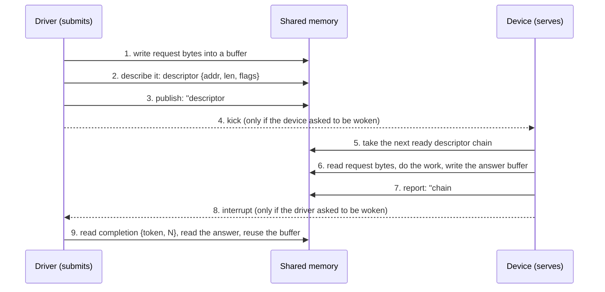
```mermaid
sequenceDiagram
  participant D as Driver (submits)
  participant M as Shared memory
  participant V as Device (serves)
  D->>M: 1. write request bytes into a buffer
  D->>M: 2. describe it: descriptor {addr, len, flags}
  D->>M: 3. publish: "descriptor #0 is ready" (advance avail counter)
  D-->>V: 4. kick (only if the device asked to be woken)
  V->>M: 5. take the next ready descriptor chain
  V->>M: 6. read request bytes, do the work, write the answer buffer
  V->>M: 7. report: "chain #0 done, wrote N bytes" (advance used counter)
  V-->>D: 8. interrupt (only if the driver asked to be woken)
  D->>M: 9. read completion {token, N}, read the answer, reuse the buffer
```

The smallest complete program: a driver asks "what is 21 × 2?" and a device
answers, in one process, over one shared byte array.
(Compiled and run: it prints `token=1 answer=42`.)

```cpp
#include <structo/virtio/split_ring.hpp>
using namespace structo;
using namespace structo::virtio;

// An "address space" is just a tag type. Addresses of different spaces are different
// C++ types, so you can never accidentally mix e.g. a guest address with a host one.
// Here there is only one space.
struct mem_space {};
using addr   = phys_addr<void, mem_space>;
using sg     = sg_entry<mem_space, std::uint64_t>;      // one buffer: { address, length }
using memory = direct_virtq_memory<mem_space>;         // how the library touches "shared memory"

int main() {
  constexpr std::uint32_t kQueueSize = 8;               // how many requests can be in flight (power of 2)
  constexpr std::uint64_t kBase = 0x10000;              // address of the first byte; must be non-zero (0 = null)
  alignas(4096) static std::byte shared[0x2000] = {};   // stands in for memory both sides can reach
  memory mem(shared, sizeof shared, addr{kBase});
  //  direct_virtq_memory(ptr, size, base):
  //    ptr  = our local pointer to the shared bytes (each side passes ITS OWN mapping)
  //    size = length of that region in bytes
  //    base = the logical address of ptr[0]; both sides must agree on it.
  //  Meaning: "this array is addresses [kBase, kBase + size)".

  // 1) Decide where the three ring areas go. try_split_layout computes the sizes and
  //    try_from_contiguous puts them back to back starting at kBase.
  auto layout = try_split_layout(kQueueSize, /*event_idx=*/false);
  //  queue_size = number of descriptors (power of two); event_idx = true only if
  //  VIRTIO_F_EVENT_IDX was negotiated (changes the ring sizes).
  auto rings  = split_ring_addrs<mem_space>::try_from_contiguous(addr{kBase}, *layout);
  //  base   = where the first area starts; layout = sizes from above.
  //  (If a peer gives you three separate addresses, build {desc, avail, used} by hand.)

  // 2) Create the two ends. The driver needs a little private bookkeeping (one slot per
  //    possible request); the device needs none.
  reloco::array<split_driver_slot, kQueueSize> slots{};
  auto driver = split_virtq_driver<mem_space, mem_space, memory>::try_create(mem, *rings, kQueueSize, slots.as_span());
  auto device = split_virtq_device<mem_space, mem_space, memory>::try_create(mem, *rings, kQueueSize);
  //  Template args: <space of the rings, space of the data buffers, memory backend>.
  //  Function args: mem = backend; *rings = ring addresses; kQueueSize = must match the layout;
  //  slots = caller-owned array, one entry per descriptor, must outlive the driver.
  //  Both calls validate everything and return an error instead of touching bad memory.

  // 3) DRIVER: put the question in a buffer, then describe two buffers: one the device
  //    reads (the question) and one it writes (the answer).
  const addr request{kBase + 0x1000}, reply{kBase + 0x1100};
  const std::uint32_t number = 21;
  (void)try_write_object(mem, request, number);         // (backend, where, value): copy a whole object in
  reloco::array<sg, 1> readable{{sg{request, sizeof number}}};   // sg{address, length in bytes}
  reloco::array<sg, 1> writable{{sg{reply,   sizeof number}}};
  (void)driver->try_add(reloco::span<const sg>(readable.data(), 1),   // buffers the device may only READ
                        reloco::span<const sg>(writable.data(), 1),   // buffers the device may WRITE
                        /*token=*/1);                                 // your cookie; returned on completion
  (void)driver->try_publish();                          // makes the request visible to the device

  // 4) DEVICE: take the request, read it, write the answer, report completion.
  reloco::array<chain_segment<mem_space>, kQueueSize> storage{};   // where the popped chain's buffer list is kept
  //  storage must be as long as the longest chain you are willing to accept.
  auto popped = device->try_pop(storage.as_span());     // returns an optional: empty = nothing queued yet
  auto &chain = **popped;
  auto in  = try_read_object<std::uint32_t>(mem, chain.readable[0].addr);  // COPY the data out of shared memory
  const std::uint32_t out = *in * 2;
  (void)try_write_object(mem, chain.writable[0].addr, out);
  (void)device->try_push_used(chain, sizeof out);       // "done, I wrote 4 bytes"
  //  try_push_used(chain, len): chain = the one popped above; len = BYTES YOU WROTE into its
  //  writable buffers. Never claim more than you wrote: the driver may read len bytes.

  // 5) DRIVER: collect the completion; the token tells us which request it was.
  auto done   = driver->try_get_used();                 // {token = 1, len = 4}
  auto answer = try_read_object<std::uint32_t>(mem, reply);   // 42
}
```

(Error handling is elided with `*` and `(void)` for brevity; every call returns a
`reloco::result`, and real code checks them.)

Things this example deliberately does **not** show, each covered later:
real notifications and sleeping ([7.2](#72-synchronization-scheme)), the two sides
using *different* memory backends ([6](#6-integration-hypervisor--guest),
[8](#8-integration-two-devices-over-a-pcie-bar)), and defending against a peer
that lies ([9](#9-hostile-peer-rules)).

> **Why `try_read_object` instead of just using a pointer?** The other side can
> change shared memory *at any instant*, even while you are reading it. If you
> check a length and then use it, it may have changed in between (a *TOCTOU* bug;
> a classic hypervisor/kernel exploit). The library therefore never hands out
> pointers into shared memory: it **copies** the bytes into your local variable,
> and you validate and use that private copy.

**Conventions you will see in every example:**

| Convention | Meaning |
|---|---|
| `try_xxx(...)` | Can fail; returns `reloco::result<T>` (a value or an `error`). No exceptions are used. |
| `reloco::optional<T>` inside a result | "Nothing available right now" is **not** an error: `try_pop` and `try_get_used` return an empty optional when the queue has nothing for you. |
| `phys_addr<void, SomeTag>` | An address *in a particular address space*. Different tags are different types, so mixing e.g. guest and host addresses is a compile error. |
| `is_broken()` | The peer broke the rules (bad index, impossible length). The queue stops working; reset it rather than continue. |
| `(void)call();` in the docs | Error handling elided for brevity. Real code checks every result. |

### 1.4 Vocabulary reference

| Term | Meaning |
|---|---|
| **Driver** | The side that *submits* requests and reaps completions (guest OS, user space client). |
| **Device** | The side that *consumes* requests, does the work, reports completion (VMM, hardware, kernel service). |
| **Buffer** | A contiguous memory range `(address, length)` holding request or response bytes. Not part of the ring. |
| **Descriptor** | A ring entry describing one buffer: address, length, flags (`NEXT`, `WRITE`, `INDIRECT`; packed adds `AVAIL`/`USED`). |
| **Chain** | One *request*: one or more descriptors. Device-**readable** ("out") buffers come first, device-**writable** ("in") buffers after. The device sees it as an `avail_chain`. |
| **Token** | The driver's opaque cookie (`std::uintptr_t`) for a chain; returned unchanged on completion. |
| **Used element** | The device's completion: chain id plus *bytes written* (`len`). |
| **Kick / notification** | Driver → device "work is available" (MMIO write, eventfd, ...). |
| **Interrupt** | Device → driver "completions are available". |
| **Suppression** | Either side may ask not to be notified (flags, or EVENT_IDX / packed `desc` event). |

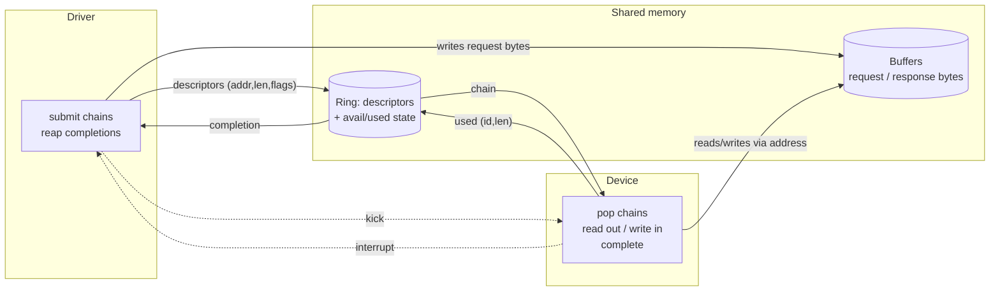
```mermaid
flowchart LR
  subgraph Driver
    D[submit chains<br/>reap completions]
  end
  subgraph Shared["Shared memory"]
    R[(Ring: descriptors<br/>+ avail/used state)]
    B[(Buffers<br/>request / response bytes)]
  end
  subgraph Device
    V[pop chains<br/>read out / write in<br/>complete]
  end
  D -- "descriptors (addr,len,flags)" --> R
  D -- "writes request bytes" --> B
  R -- "chain" --> V
  V -- "reads/writes via address" --> B
  V -- "used (id,len)" --> R
  R -- "completion" --> D
  D -. "kick" .-> V
  V -. "interrupt" .-> D
```

### A chain

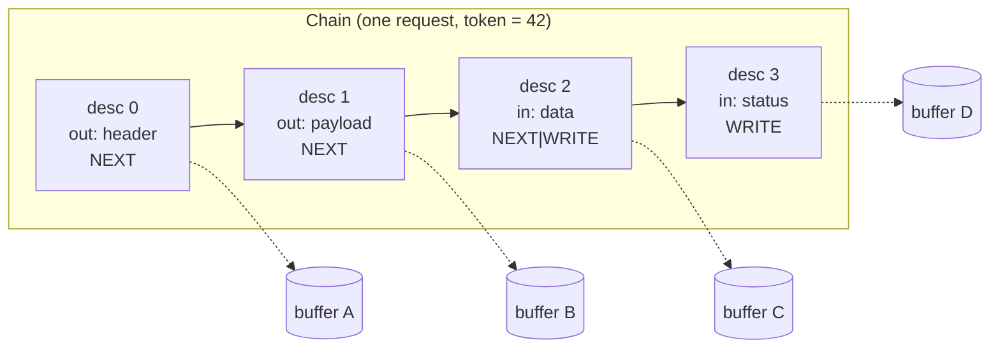
```mermaid
flowchart LR
  subgraph chain["Chain (one request, token = 42)"]
    direction LR
    o1["desc 0<br/>out: header<br/>NEXT"] --> o2["desc 1<br/>out: payload<br/>NEXT"] --> i1["desc 2<br/>in: data<br/>NEXT|WRITE"] --> i2["desc 3<br/>in: status<br/>WRITE"]
  end
  o1 -.-> b1[(buffer A)]
  o2 -.-> b2[(buffer B)]
  i1 -.-> b3[(buffer C)]
  i2 -.-> b4[(buffer D)]
```

`readable` segments (header, payload) must precede `writable` ones (data,
status); both library sides enforce this. A buffer may live in a different
address space than the ring (see `BufSpace` below).

### Split ring

Three separate areas: the **descriptor table** (driver-written), the **avail
ring** (driver → device: head indices of ready chains) and the **used ring**
(device → driver: `{id, len}` of completed chains). Each side advances its own
free-running 16-bit index.

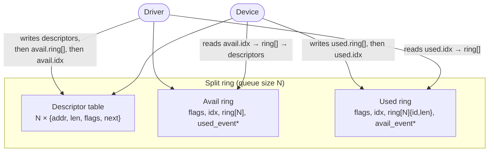
```mermaid
flowchart TB
  subgraph split["Split ring (queue size N)"]
    DT["Descriptor table<br/>N × {addr, len, flags, next}"]
    AV["Avail ring<br/>flags, idx, ring[N], used_event*"]
    US["Used ring<br/>flags, idx, ring[N]{id,len}, avail_event*"]
  end
  Drv([Driver]) -->|"writes descriptors,<br/>then avail.ring[], then avail.idx"| DT
  Drv --> AV
  Dev([Device]) -->|"reads avail.idx → ring[] → descriptors"| AV
  Dev --> DT
  Dev -->|"writes used.ring[], then used.idx"| US
  Drv -->|"reads used.idx → ring[]"| US
```
`*` present only with EVENT_IDX.

### Indirect descriptors

One ring descriptor flagged `INDIRECT` points at a driver-owned *table* of
further descriptors, so a long scatter-gather list consumes a single ring slot.
Split ring only.

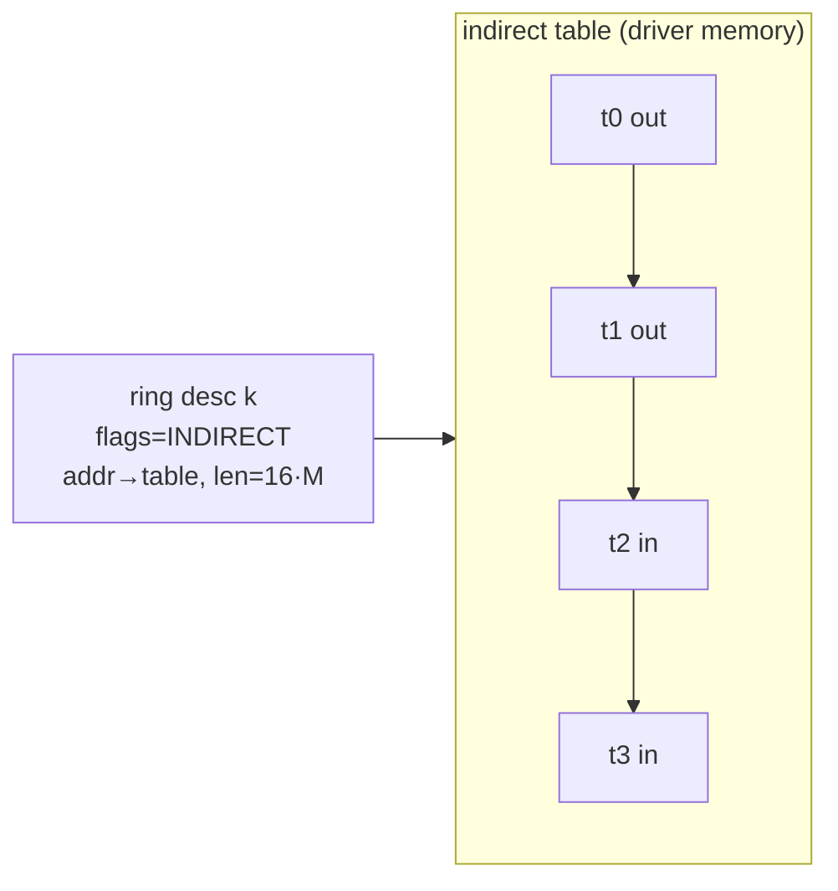
```mermaid
flowchart LR
  ring["ring desc k<br/>flags=INDIRECT<br/>addr→table, len=16·M"] --> tbl
  subgraph tbl["indirect table (driver memory)"]
    t0["t0 out"] --> t1["t1 out"] --> t2["t2 in"] --> t3["t3 in"]
  end
```
Rules enforced: the indirect descriptor ends its chain (no `NEXT`), length is a
non-zero multiple of 16, no nested `INDIRECT`, `next` stays inside the table,
loops are rejected.

### Packed ring

One ring of descriptors serves both directions. Ownership is encoded in two flag
bits per descriptor, `AVAIL` and `USED`, compared with a per-side **wrap
counter** that flips each time the position passes the end of the ring. The
device completes a chain by overwriting its first descriptor's slot with
`{buffer id, len}`.

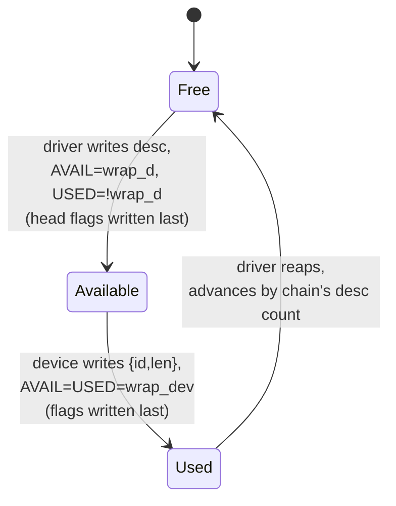
```mermaid
stateDiagram-v2
  [*] --> Free
  Free --> Available: driver writes desc,<br/>AVAIL=wrap_d, USED=!wrap_d<br/>(head flags written last)
  Available --> Used: device writes {id,len},<br/>AVAIL=USED=wrap_dev<br/>(flags written last)
  Used --> Free: driver reaps,<br/>advances by chain's desc count
```

### Split or packed: which should I use?

*Plain-language version.* The **split** ring is the original, simplest design
and is supported by every VIRTIO implementation: three separate tables, easy to
reason about and to debug. The **packed** ring (VIRTIO 1.1+) merges them into
one table so a request touches fewer cache lines, which helps at high request
rates, but both ends must support it. A reasonable default is: use **split**
unless you control both ends and have measured a need for packed; if you must
support both, write your code against `virtq_driver_ref` / `virtq_device_ref`
([section 5](#5-type-erased-classes)) so the choice is a one-line decision.

### Chosen layout comparison

| | Split | Packed |
|---|---|---|
| Areas | 3 (desc / avail / used) | 1 ring + 2 event words |
| Publish step | `avail.idx` store (`try_publish`) | head descriptor flags store (inside `try_add`) |
| Out-of-order completion | yes | yes |
| Indirect descriptors | yes | not supported |
| EVENT_IDX | `used_event`/`avail_event` | `desc` event suppression |

---

## 2. Class hierarchy and design

There is **no inheritance** and no virtual dispatch in the core. Customisation
is by template parameter and trait specialisation; run-time polymorphism is an
optional layer on top (type-erased handles).

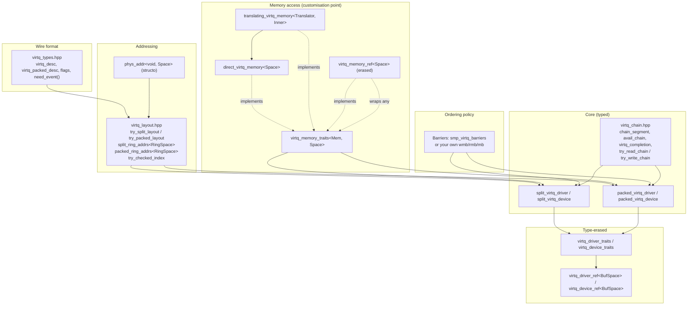
```mermaid
flowchart TB
  subgraph L1["Wire format"]
    types["virtq_types.hpp<br/>virtq_desc, virtq_packed_desc, flags, need_event()"]
  end
  subgraph L2["Addressing"]
    pa["phys_addr&lt;void, Space&gt; (structo)"]
    lay["virtq_layout.hpp<br/>try_split_layout / try_packed_layout<br/>split_ring_addrs&lt;RingSpace&gt;<br/>packed_ring_addrs&lt;RingSpace&gt;<br/>try_checked_index"]
  end
  subgraph L3["Memory access (customisation point)"]
    traits["virtq_memory_traits&lt;Mem, Space&gt;"]
    direct["direct_virtq_memory&lt;Space&gt;"]
    trans["translating_virtq_memory&lt;Translator, Inner&gt;"]
    mref["virtq_memory_ref&lt;Space&gt; (erased)"]
  end
  subgraph L4["Ordering policy"]
    bar["Barriers: smp_virtq_barriers<br/>or your own wmb/rmb/mb"]
  end
  subgraph L5["Core (typed)"]
    sd["split_virtq_driver / split_virtq_device"]
    pd["packed_virtq_driver / packed_virtq_device"]
    chain["virtq_chain.hpp<br/>chain_segment, avail_chain, virtq_completion,<br/>try_read_chain / try_write_chain"]
  end
  subgraph L6["Type-erased"]
    dt["virtq_driver_traits / virtq_device_traits"]
    dref["virtq_driver_ref&lt;BufSpace&gt; / virtq_device_ref&lt;BufSpace&gt;"]
  end

  types --> lay
  pa --> lay
  lay --> sd
  lay --> pd
  traits --> sd
  traits --> pd
  direct -. implements .-> traits
  trans -. implements .-> traits
  mref -. implements .-> traits
  trans --> direct
  mref -. wraps any .-> traits
  bar --> sd
  bar --> pd
  chain --> sd
  chain --> pd
  sd --> dt
  pd --> dt
  dt --> dref
```

### Template parameters shared by all core classes

`split_virtq_driver<RingSpace, BufSpace, Mem, Barriers = smp_virtq_barriers>`
(and the other three):

| Parameter | Role |
|---|---|
| `RingSpace` | Address-space tag of the **ring areas**. Ring addresses are `phys_addr<void, RingSpace>`. |
| `BufSpace` | Address-space tag of the **buffers** as the *peer* addresses them. Segments in the API are `sg_entry<BufSpace>` / `chain_segment<BufSpace>`. |
| `Mem` | Backend that reads/writes **ring** memory through `virtq_memory_traits<Mem, RingSpace>`. |
| `Barriers` | Memory-ordering policy (`wmb`/`rmb`/`mb`). |

The tag types are what make "the queue may live in various memory types"
safe: a guest-physical address, a host-virtual offset, and a device-bus address
are distinct, non-convertible C++ types, and conversion only happens in an
explicit `phys_translator`.

Buffers are *not* reached by the ring classes; the device-side caller reads and
writes them with `try_read_chain` / `try_write_chain` and a buffer-memory backend
of its choice (`virtq_memory_traits<BufMem, BufSpace>`).

---

## 3. Foundations

### `virtq_types.hpp`
`virtq_desc`, `virtq_avail_header`, `virtq_used_header`, `virtq_used_elem`,
`virtq_packed_desc`, `virtq_packed_event`: fixed-width structs, `static_assert`ed
against the spec. `desc_f_*`, `avail_f_no_interrupt`, `used_f_no_notify`,
`event_flags_*`, `feature_*` bit positions with `has_feature()`, and
`need_event(event_idx, new_idx, old_idx)` (modulo-2^16 EVENT_IDX test).

### `virtq_layout.hpp`
- `try_split_layout(queue_size, event_idx)` / `try_packed_layout(queue_size)`:
  area sizes and a contiguous placement (`error::invalid_argument` on a bad
  queue size: power of two in `[1, 32768]`).
- `split_ring_addrs<RingSpace>` / `packed_ring_addrs<RingSpace>`: area bases
  as `phys_addr<void, RingSpace>`; `try_from_contiguous`, `try_validate`
  (null / alignment / wrap), element address helpers.
- `try_checked_index(index, limit)`: validates a **peer-controlled** index with
  speculation masking; every indexed address helper goes through it.

### `virtq_memory.hpp`
`virtq_memory_traits<Mem, Space>` is the customisation point: `try_read`,
`try_write`, `try_load16`, `try_store16` over `phys_addr<void, Space>`.
`direct_virtq_memory<Space>` is a bounds- and alignment-checked backend over a
flat host window `[base, base + size)` of `Space`. `try_read_object<T>` /
`try_write_object<T>` copy trivially-copyable values.

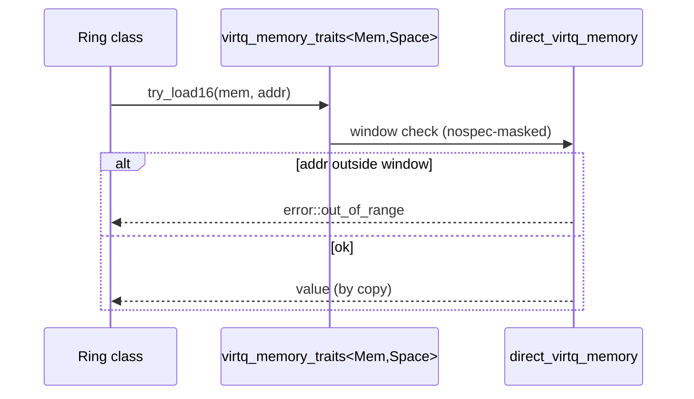
```mermaid
sequenceDiagram
  participant Ring as Ring class
  participant Tr as virtq_memory_traits<Mem,Space>
  participant Mem as direct_virtq_memory
  Ring->>Tr: try_load16(mem, addr)
  Tr->>Mem: window check (nospec-masked)
  alt addr outside window
    Mem-->>Ring: error::out_of_range
  else ok
    Mem-->>Ring: value (by copy)
  end
```

### `virtq_barrier.hpp`
`Barriers` policy: `wmb` (prior stores visible before later stores), `rmb`
(prior loads complete before later loads), `mb` (full). `smp_virtq_barriers`
uses `std::atomic_thread_fence` and is correct whenever both sides are
cache-coherent CPUs (guest↔VMM, user↔kernel). Provide your own for MMIO /
non-coherent device memory.

| Who | Ordering | Barrier |
|---|---|---|
| driver | descriptors + avail entry → publish `avail.idx` | `wmb` |
| driver | publish → read `used.flags` (notify decision) | `mb` |
| driver | read `used.idx` → read used elements | `rmb` |
| device | read `avail.idx` → read entries/descriptors | `rmb` |
| device | write used element → publish `used.idx` | `wmb` |
| device | publish → read `avail.flags` (interrupt decision) | `mb` |

### `virtq_chain.hpp`
`chain_segment<BufSpace>{addr, len}`, `avail_chain<BufSpace>` (`head`,
`desc_count`, `readable`, `writable`, byte totals; spans view the caller's
storage), `virtq_completion{token, len}`, and `try_read_chain` /
`try_write_chain` (copy bytes from/to a segment list at an offset, bounds
checked, never returning pointers into peer memory).

---

## 4. Core typed classes

All four classes are **single-threaded per instance**: one driver object has one
owner at a time, as does one device object. Serialise multiple submitters with
your own lock. Every method returns `reloco::result<>`; a protocol violation by
the peer latches a sticky `is_broken()` state after which calls fail with
`error::invalid_state`.

### 4.1 `split_virtq_driver`

Role: submit chains, decide whether to kick, reap completions.

| Method | Purpose |
|---|---|
| `try_create(mem, addrs, queue_size, slots, event_idx=false)` | Bind to a zeroed ring; `slots` is caller-owned `split_driver_slot[≥queue_size]` bookkeeping. |
| `try_add(out, in, token)` | Stage a chain (`span<const sg_type>` out/in). Descriptors written; **not yet visible**. |
| `try_add_indirect(out, in, token, table_mem, table_write, table_dev, table_bytes)` | Same, but one ring descriptor → indirect table in caller memory. |
| `try_publish()` | `wmb`, then store `avail.idx`: staged chains become visible. |
| `needs_notify()` | `mb`, then decide (flag, or `need_event` with EVENT_IDX). Call once per publish/batch. |
| `try_get_used()` | Reap one completion (`optional<virtq_completion>`). |
| `try_set_interrupts_enabled(bool)` / `try_set_used_event(idx)` | Interrupt suppression / coalescing. |
| `free_descriptors()`, `queue_size()`, `is_broken()` | State. |

The device is **distrusted**: a used `id` must be in flight and `len` must not
exceed the chain's writable capacity, else `security_violation` + broken.

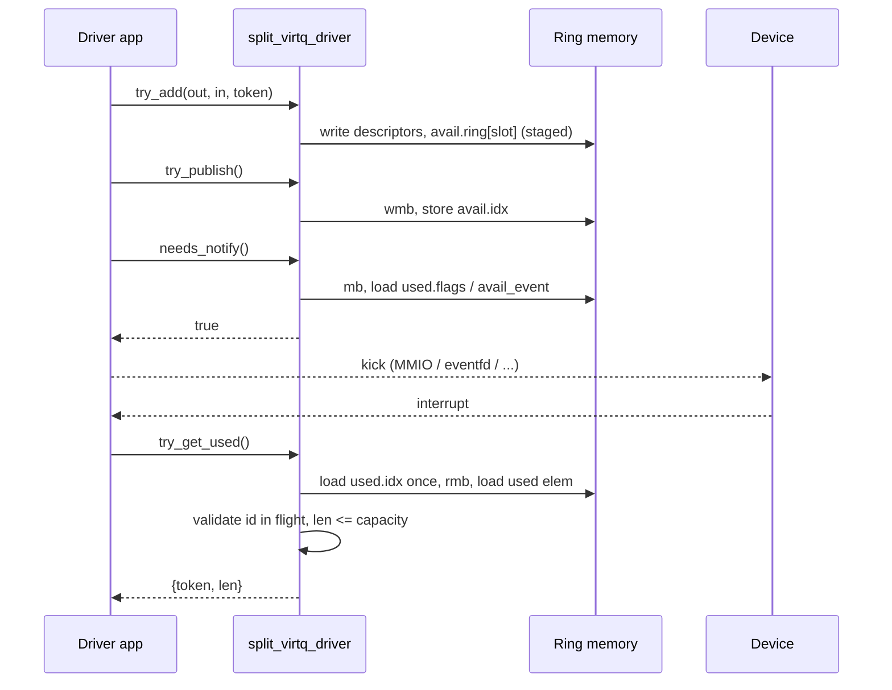
```mermaid
sequenceDiagram
  participant App as Driver app
  participant D as split_virtq_driver
  participant M as Ring memory
  participant Dev as Device
  App->>D: try_add(out, in, token)
  D->>M: write descriptors, avail.ring[slot] (staged)
  App->>D: try_publish()
  D->>M: wmb, store avail.idx
  App->>D: needs_notify()
  D->>M: mb, load used.flags / avail_event
  D-->>App: true
  App-->>Dev: kick (MMIO / eventfd / ...)
  Dev-->>App: interrupt
  App->>D: try_get_used()
  D->>M: load used.idx once, rmb, load used elem
  D->>D: validate id in flight, len <= capacity
  D-->>App: {token, len}
```

### 4.2 `split_virtq_device`

Role: pop chains, do the work, complete them.

| Method | Purpose |
|---|---|
| `try_create(mem, addrs, queue_size, event_idx=false)` | Bind to the ring. |
| `try_pop(storage)` | Pop the next chain into caller storage (`span<chain_segment>`). Rejects `INDIRECT`. |
| `try_pop(storage, buf_mem)` | Same, additionally resolving indirect tables read through `buf_mem`. |
| `try_push_used(chain, written)` | Complete: write used element, `wmb`, publish `used.idx`. |
| `should_interrupt()` | `mb`, then decide. Call once per completion batch. |
| `try_set_notify_enabled(bool)` | Kick suppression (`NO_NOTIFY` / `avail_event`). |

A popped chain is validated: indices in range (speculation-safe), no loops,
readable before writable, result fits `storage`. Violations latch broken.

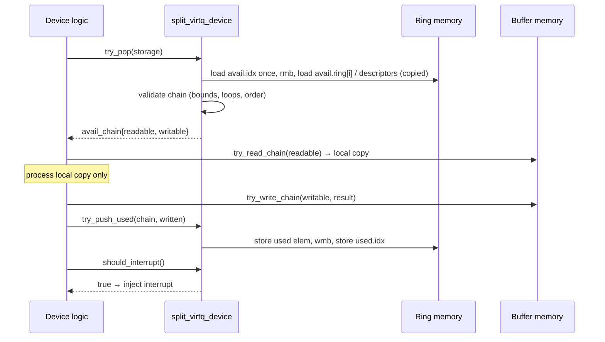
```mermaid
sequenceDiagram
  participant Dev as Device logic
  participant D as split_virtq_device
  participant M as Ring memory
  participant B as Buffer memory
  Dev->>D: try_pop(storage)
  D->>M: load avail.idx once, rmb, load avail.ring[i] / descriptors (copied)
  D->>D: validate chain (bounds, loops, order)
  D-->>Dev: avail_chain{readable, writable}
  Dev->>B: try_read_chain(readable) → local copy
  Note over Dev: process local copy only
  Dev->>B: try_write_chain(writable, result)
  Dev->>D: try_push_used(chain, written)
  D->>M: store used elem, wmb, store used.idx
  Dev->>D: should_interrupt()
  D-->>Dev: true → inject interrupt
```

### 4.3 `packed_virtq_driver` / `packed_virtq_device`

Same template parameters and same method names, with these differences:

- **No `try_publish`.** `try_add` writes every descriptor, issues `wmb`, then
  writes the **head descriptor's flags last**; that store is the publish.
  `needs_notify()` is still called once per batch.
- Ownership is the `AVAIL`/`USED` bits against wrap counters. A head that is not
  available means "nothing to pop"; a *later* descriptor of the chain that is
  not available is a protocol violation.
- The device overwrites the slot with `{id, len}` (flags last, after `wmb`).
  Both sides advance by the chain's descriptor count (`avail_chain::desc_count`).
  `chain::head` is the buffer id from the chain's last descriptor.
- Suppression: `try_set_interrupts_enabled` / `try_set_notify_enabled` write the
  event-suppression flags; with `event_idx`, `try_set_interrupt_after(n)` /
  `try_set_notify_after(n)` select `desc` mode (position + wrap).
- `packed_driver_slot` replaces `split_driver_slot`. No indirect descriptors.

```mermaid
sequenceDiagram
  participant Drv as packed_virtq_driver
  participant R as Packed ring
  participant Dev as packed_virtq_device
  Drv->>R: write desc[1..n] (flags no AVAIL yet)
  Drv->>R: wmb
  Drv->>R: write desc[0].flags (AVAIL=wrap, USED=!wrap)  ← publish
  Drv->>Drv: needs_notify() → kick?
  Dev->>R: load desc[pos].flags once; is_avail(wrap)?
  Dev->>R: rmb, read rest of chain
  Dev->>R: write desc[pos] = {id,len}
  Dev->>R: wmb
  Dev->>R: write desc[pos].flags (AVAIL=USED=wrap)  ← complete
  Drv->>R: load desc[pos].flags once; is_used(wrap)?
  Drv->>R: rmb, read {id,len}; validate; advance by desc count
```

### 4.4 Choosing a memory backend

| Backend | Use when | Interaction |
|---|---|---|
| `direct_virtq_memory<Space>` | Ring is in a flat window you can map. | Direct checked copy. |
| `translating_virtq_memory<Translator, Inner>` | Ring is addressed in one space (e.g. guest-physical) but reachable only through another (host window). | Every access goes through a `phys_translator` (exact access size, 2 for 16-bit); failure never reaches `Inner`. |
| `virtq_memory_ref<Space>` | One ring type must serve several backends at run time. | Vtable of read/write/load16/store16; unbound calls give `unsupported_operation`. |
| your own | MMIO, IOMMU, bounce buffers. | Specialise `virtq_memory_traits`; **must** keep the by-value + nospec rules (section 11). |

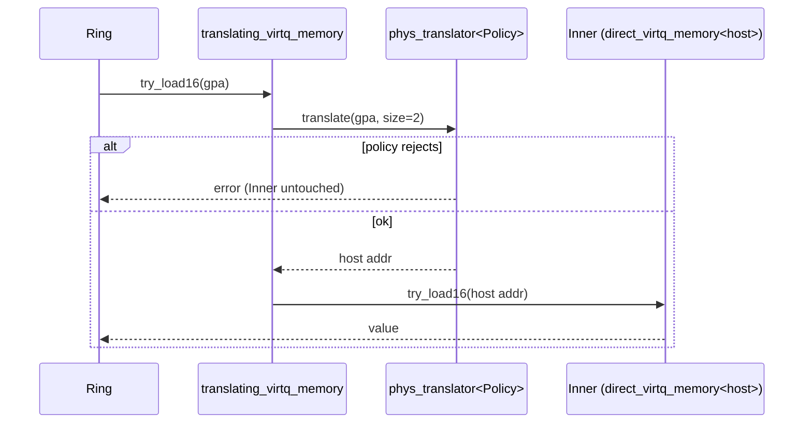
```mermaid
sequenceDiagram
  participant Ring
  participant T as translating_virtq_memory
  participant P as phys_translator<Policy>
  participant In as Inner (direct_virtq_memory<host>)
  Ring->>T: try_load16(gpa)
  T->>P: translate(gpa, size=2)
  alt policy rejects
    P-->>Ring: error (Inner untouched)
  else ok
    P-->>T: host addr
    T->>In: try_load16(host addr)
    In-->>Ring: value
  end
```

---

## 5. Type-erased classes

For code that must not care about the ring layout or the concrete `Mem` /
`Barriers` (generic device frameworks, device-model plug-ins), `virtq_ref.hpp`
and `virtq_memory_adapters.hpp` provide non-owning, pointer-sized-pair handles
(`ctx` + static vtable, same pattern as `block_device_ref`).

| Handle | Erases | Built from |
|---|---|---|
| `virtq_memory_ref<Space>` | the memory backend | any `Backend&` with `virtq_memory_traits<Backend, Space>` |
| `virtq_driver_ref<BufSpace>` | ring layout, `RingSpace`, `Mem`, `Barriers` | `split_virtq_driver&` or `packed_virtq_driver&` (or anything with `virtq_driver_traits`) |
| `virtq_device_ref<BufSpace>` | same, for the device side | `split_virtq_device&` / `packed_virtq_device&` |

Properties:
- **Non-owning.** Binding to an rvalue is deleted; the referent must outlive
  the handle.
- **Default-constructed = unbound.** Calls return `unsupported_operation`,
  `is_broken()` returns `true`, counts return `0`.
- Driver handle API: `try_add`, `try_publish`, `needs_notify`, `try_get_used`,
  `try_set_interrupts_enabled`, `free_descriptors`, `queue_size`, `is_broken`.
  On a packed ring `try_publish` is a no-op, so the same calling sequence works
  for both layouts.
- Device handle API: `try_pop`, `try_push_used`, `should_interrupt`,
  `try_set_notify_enabled`, `queue_size`, `is_broken`.
- **Not erased:** indirect descriptors, EVENT_IDX tuning (`try_set_used_event`,
  `*_after`). Use the concrete class for those.
- `virtq_driver_traits<Driver>` / `virtq_device_traits<Device>` forward to the
  members by default; specialise them to adapt a custom ring.

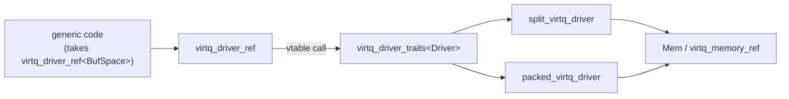
```mermaid
flowchart LR
  app["generic code<br/>(takes virtq_driver_ref&lt;BufSpace&gt;)"] --> ref["virtq_driver_ref"]
  ref -- "vtable call" --> tr["virtq_driver_traits&lt;Driver&gt;"]
  tr --> s["split_virtq_driver"]
  tr --> p["packed_virtq_driver"]
  s --> mem1["Mem / virtq_memory_ref"]
  p --> mem1
```

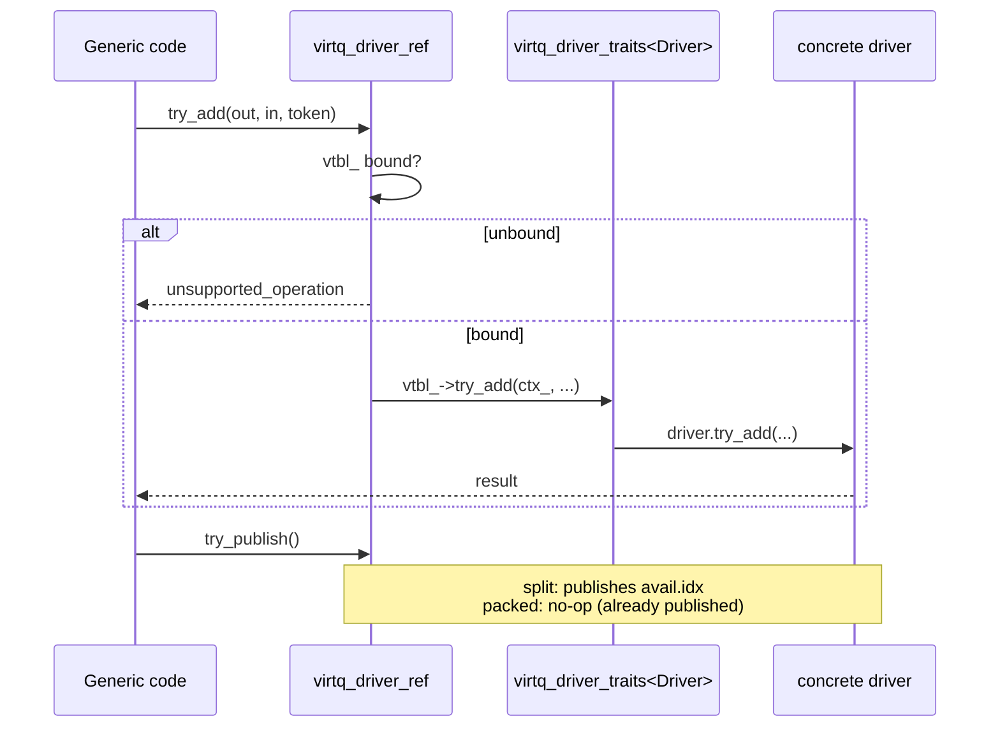
```mermaid
sequenceDiagram
  participant G as Generic code
  participant R as virtq_driver_ref
  participant T as virtq_driver_traits<Driver>
  participant C as concrete driver
  G->>R: try_add(out, in, token)
  R->>R: vtbl_ bound?
  alt unbound
    R-->>G: unsupported_operation
  else bound
    R->>T: vtbl_->try_add(ctx_, ...)
    T->>C: driver.try_add(...)
    C-->>G: result
  end
  G->>R: try_publish()
  Note over R,C: split: publishes avail.idx<br/>packed: no-op (already published)
```

---

## 6. Integration: hypervisor ↔ guest

Setting: a guest kernel (driver) and a VMM (device). Guest RAM is a single
region; the guest addresses it by **guest-physical address (GPA)**, the VMM
reaches the same bytes through its own mapping (**host window**). The ring *and*
buffers are in guest RAM, so the guest uses GPAs for everything, and the VMM
translates.

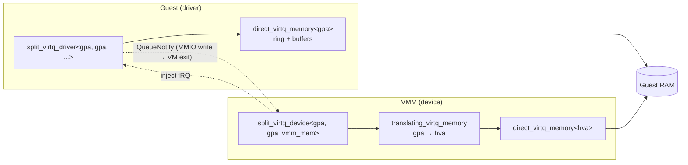
```mermaid
flowchart LR
  subgraph Guest["Guest (driver)"]
    gm["direct_virtq_memory&lt;gpa&gt;<br/>ring + buffers"]
    gd["split_virtq_driver&lt;gpa, gpa, ...&gt;"]
  end
  RAM[(Guest RAM)]
  subgraph VMM["VMM (device)"]
    tm["translating_virtq_memory<br/>gpa → hva"]
    hr["direct_virtq_memory&lt;hva&gt;"]
    vd["split_virtq_device&lt;gpa, gpa, vmm_mem&gt;"]
  end
  gd --> gm --> RAM
  vd --> tm --> hr --> RAM
  gd -. "QueueNotify (MMIO write → VM exit)" .-> vd
  vd -. "inject IRQ" .-> gd
```

Key points:
- `RingSpace = BufSpace = gpa` on both sides: the device never sees a host
  address in the API, only GPAs; the translator is the **only** place a GPA
  becomes a host address.
- The translation policy is the guest-memory map and is the primary hostile-guest
  barrier: out-of-RAM GPAs fail with `out_of_range` before touching memory. It
  must bounds-check `[gpa, gpa+len)` with the exact length and be speculation
  safe (use `reloco::nospec::sanitize`).
- A *per-queue* ring address/size comes from the transport (virtio-mmio
  `QueueDesc*`, `QueueAvail*`, `QueueUsed*`, `QueueNum`); build
  `split_ring_addrs` from those and call `try_validate` (done by `try_create`).
- Kick and interrupt are transport-specific and live outside the library.

**What the code below is, and why you need it.** A guest and a VMM describe the
*same* RAM with different numbers: the guest says "address `0x8000_1000`", the
VMM must turn that into a pointer into *its own* mapping. Doing that conversion
in one named place, the `ram_policy`, is what protects the VMM: if the guest
hands over an address outside its RAM, the policy refuses it and nothing is
touched. Everything else (the ring classes, `try_read_chain`) just carries the
guest's numbers around without interpreting them. The two `direct_virtq_memory`
objects are "this array is that address range"; `translating_virtq_memory` glues
the policy in front of the VMM's one. (In a real VMM `ram` is the host mapping
of guest memory; here both halves share one array so it runs in one process.)

```cpp
struct gpa {}; struct hva {};                     // tags: guest-physical address space / host window
struct ram_policy {                               // the guest memory map: the ONE place that vets guest addresses
  using from_space = gpa; using to_space = hva;
  // g   = guest-physical address the guest handed us (untrusted)
  // len = how many bytes the caller is about to touch there
  // returns the host-window address, or an error if [g, g+len) is outside guest RAM
  reloco::result<std::uint64_t> translate(std::uint64_t g, std::uint64_t len) const noexcept {
    if (g < kRamGpa || g - kRamGpa > kRamSize || len > kRamSize - (g - kRamGpa))
      return reloco::unexpected(reloco::error::out_of_range);
    return kRamHva + (g - kRamGpa);               // kRamGpa/kRamHva = base of RAM as the guest/VMM sees it
  }
};
using guest_mem = direct_virtq_memory<gpa>;       // guest's own view of RAM
using host_ram  = direct_virtq_memory<hva>;       // VMM's mapping of the same RAM
using vmm_mem   = translating_virtq_memory<phys_translator<ram_policy>, host_ram>;
                  // = "translate every GPA with ram_policy, then access host_ram"

// --- guest ---
guest_mem g_mem(ram, kRamSize, gpa_addr{kRamGpa});   // (ptr to RAM, size, guest-physical base)
auto drv = split_virtq_driver<gpa, gpa, guest_mem>::try_create(g_mem, *addrs, kQ, slots.as_span());
                  // (memory, ring addresses, queue size, per-descriptor bookkeeping array)
(void)try_write_object(g_mem, req_gpa, request);                      // put request in RAM
(void)drv->try_add(out_sg, in_sg, /*token=*/1);   // out_sg: device-readable buffers, in_sg: device-writable
(void)drv->try_publish();                         // make the chain visible to the device
if (auto n = drv->needs_notify(); n && *n) { /* MMIO write to QueueNotify */ }  // true = device wants a doorbell

// --- VMM, on the kick ---
host_ram h_ram(ram, kRamSize, hva_addr{kRamHva});                     // same bytes, host-side address
vmm_mem  v_mem(phys_translator<ram_policy>(ram_policy{}), h_ram);     // (translator, inner backend)
auto dev = split_virtq_device<gpa, gpa, vmm_mem>::try_create(v_mem, *addrs, kQ);
auto popped = dev->try_pop(segs.as_span());       // segs: storage for the chain, sized for the longest chain accepted
if (popped && *popped) {
  auto &c = **popped;
  // (memory, segments, byte offset into the concatenated chain, local destination)
  (void)try_read_chain(v_mem, c.readable, 0, local.as_span().first(n)); // copy out, then validate/use
  /* ... device logic on the local copy ... */
  (void)try_write_chain(v_mem, c.writable, 0, reply);                   // (memory, segments, offset, local source)
  (void)dev->try_push_used(c, bytes_written);     // bytes_written = bytes actually written to the writable buffers
  if (auto i = dev->should_interrupt(); i && *i) { /* inject guest IRQ */ }   // true = guest wants an IRQ
}
// --- guest, in the IRQ handler ---
auto done = drv->try_get_used();                                      // {token, len}
```
(Compiled and run as a single-process simulation; indirect tables use
`try_pop(storage, v_mem)` with the same `v_mem`.)


Sequence of one request:

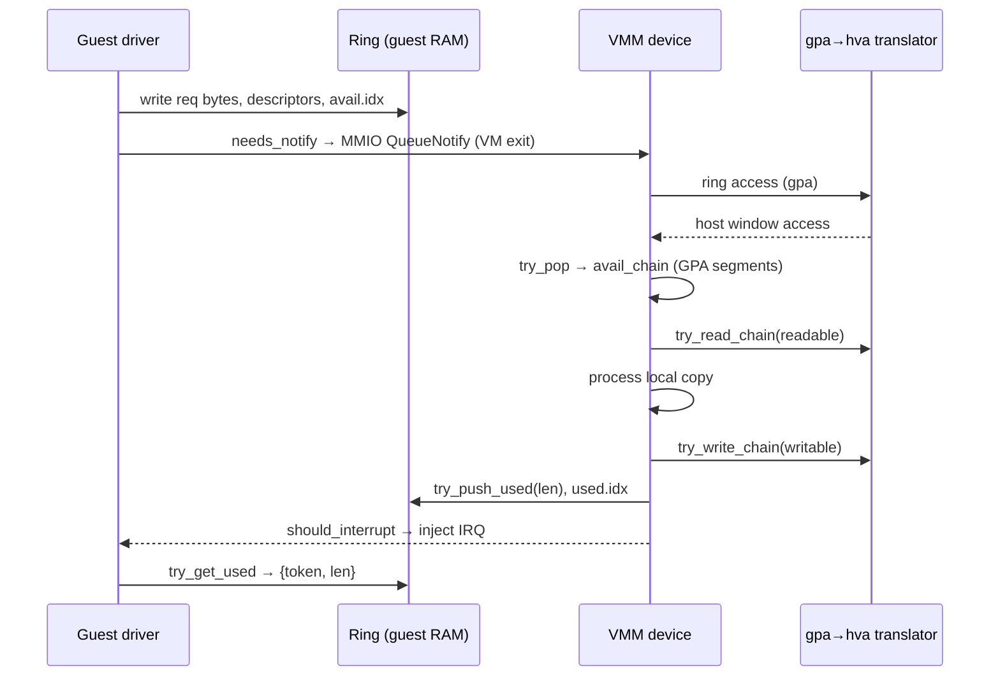
```mermaid
sequenceDiagram
  participant G as Guest driver
  participant Ring as Ring (guest RAM)
  participant VMM as VMM device
  participant Tr as gpa→hva translator
  G->>Ring: write req bytes, descriptors, avail.idx
  G->>VMM: needs_notify → MMIO QueueNotify (VM exit)
  VMM->>Tr: ring access (gpa)
  Tr-->>VMM: host window access
  VMM->>VMM: try_pop → avail_chain (GPA segments)
  VMM->>Tr: try_read_chain(readable)
  VMM->>VMM: process local copy
  VMM->>Tr: try_write_chain(writable)
  VMM->>Ring: try_push_used(len), used.idx
  VMM-->>G: should_interrupt → inject IRQ
  G->>Ring: try_get_used → {token, len}
```

For a generic device model (many device types, split *or* packed negotiated at
run time) hold `virtq_device_ref<gpa>` instead of the concrete type, built after
`VIRTIO_F_RING_PACKED` negotiation; see [section 5](#5-type-erased-classes).

---

## 7. Integration: user space ↔ kernel (software only)

Setting: no hardware and no hypervisor: a process (driver) and the kernel or
another process (device) share a memory region (e.g. `mmap` of a kernel-allocated
page set, a memfd, or a shared mapping). The ring and a **data pool** live in
that region; the "address space" is simply **offsets within it**, so both
sides use the same tag `shm` and each wraps *its own mapping* in a
`direct_virtq_memory<shm>` with the *same logical base*.

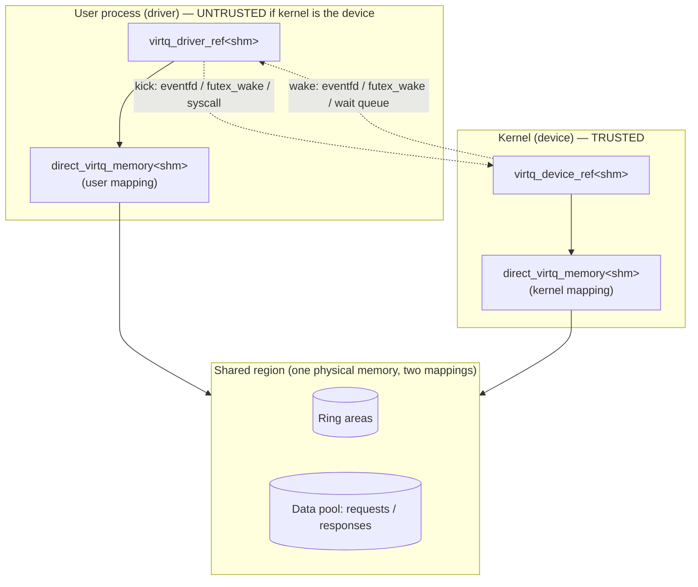
```mermaid
flowchart TB
  subgraph region["Shared region (one physical memory, two mappings)"]
    ring[(Ring areas)]
    pool[(Data pool: requests / responses)]
  end
  subgraph U["User process (driver) — UNTRUSTED if kernel is the device"]
    um["direct_virtq_memory&lt;shm&gt;<br/>(user mapping)"]
    ud["virtq_driver_ref&lt;shm&gt;"]
  end
  subgraph K["Kernel (device) — TRUSTED"]
    km["direct_virtq_memory&lt;shm&gt;<br/>(kernel mapping)"]
    kd["virtq_device_ref&lt;shm&gt;"]
  end
  ud --> um --> region
  kd --> km --> region
  ud -. "kick: eventfd / futex_wake / syscall" .-> kd
  kd -. "wake: eventfd / futex_wake / wait queue" .-> ud
```

Notes:
- **Base address must be non-zero.** `phys_addr` treats `0` as null; use e.g.
  `kBase = 0x10000`. Only the logical numbering matters, not the real address.
- `BufSpace == RingSpace == shm`; every segment address is an offset into the
  region. The kernel never dereferences a user pointer: all access goes through
  the bounds-checked backend, so a user supplying an out-of-region address just
  gets `out_of_range`.
- Because user space is the untrusted party, the device is the kernel and
  must follow the hostile-peer rules (section 11). If the roles are reversed
  (kernel is the driver) the *driver* class already distrusts the device.
- Written once against the type-erased handles, the same user library works with
  either ring layout.

### 7.1 Data path

**What this is, and why.** This is the whole user↔kernel conversation without
any waiting: put a request in the shared region, describe it, publish it; the
other side pops it, copies it out, answers, completes it. Two details are easy
to miss: (a) each side wraps *its own* mapping of the region (the user and the
kernel have different pointers to the same pages) but both give it the *same
logical base address*, so the offsets stored in descriptors mean the same thing to
both; (b) `submit()` takes `virtq_driver_ref`, so the same helper works whether
the ring underneath is split or packed.

```cpp
struct shm {};                                   // tag for the shared region (user and kernel both see it)
using addr = phys_addr<void, shm>;
using sg   = sg_entry<shm, std::uint64_t>;
using mem  = direct_virtq_memory<shm>;
constexpr std::uint64_t kBase = 0x10000,         // logical address of the rings; same on both sides
                        kPool = kBase + 0x1000;  // logical address of the message cells (right after the rings)

// Written once against the handle: works for split or packed.
//   q    = type-erased driver handle (non-owning; the concrete driver must outlive it)
//   m    = the memory backend that same ring uses
//   slot = index of a 64-byte cell in the pool: request at +0, reply at +32.
//          Don't reuse a slot until its completion has been reaped.
//   r    = the request payload (trivially copyable)
//   tok  = your cookie; try_get_used() hands it back so you know which request finished
reloco::result<void> submit(virtq_driver_ref<shm> q, mem &m, std::uint32_t slot, request r, std::uintptr_t tok) {
  const addr req{kPool + slot * 64u}, rsp{kPool + slot * 64u + 32u};
  if (auto w = try_write_object(m, req, r); !w) return w;
  reloco::array<sg, 1> out{{sg{req, sizeof r}}};       // device reads the request ...
  reloco::array<sg, 1> in{{sg{rsp, 4}}};               // ... and writes a 4-byte reply
  if (auto a = q.try_add(reloco::span<const sg>(out.data(), 1), reloco::span<const sg>(in.data(), 1), tok); !a)
    return a;
  return q.try_publish();
}

// each side wraps ITS OWN mapping with the same logical base:
//   user_ptr / kernel_ptr = this side's pointer to the shared pages; size = region length in bytes
mem user_mem(user_ptr,   size, addr{kBase});
mem kern_mem(kernel_ptr, size, addr{kBase});
// kQ = queue size (power of 2); *addrs = ring addresses (try_from_contiguous, see 1.3);
// slots = driver's per-descriptor bookkeeping array
auto drv = split_virtq_driver<shm, shm, mem>::try_create(user_mem, *addrs, kQ, slots.as_span());
auto dev = split_virtq_device<shm, shm, mem>::try_create(kern_mem, *addrs, kQ);   // validates the user-influenced layout
virtq_driver_ref<shm> uq(*drv);  virtq_device_ref<shm> kq(*dev);   // handles bound to the concrete objects

// kernel
auto p = kq.try_pop(segs.as_span());           // segs: chain_segment storage sized for the longest chain accepted
auto r = try_read_object<request>(kern_mem, (**p).readable[0].addr);   // copy-out: TOCTOU-safe
(void)try_write_object(kern_mem, (**p).writable[0].addr, result);
(void)kq.try_push_used(**p, sizeof result);    // (chain, bytes written into its writable buffers)
```


### 7.2 Synchronization scheme

There are **two independent layers** to get right: *memory ordering* (what each
side may observe) and *sleep/wake-up* (how a side that has run out of work
blocks without losing a wake-up).

#### Layer 1: memory ordering

Handled inside the ring classes via `Barriers` (default `smp_virtq_barriers`,
fences on `std::atomic_thread_fence`). Per-queue rules:

- **One driver thread, one device thread.** Each ring class instance is
  single-threaded; serialise concurrent submitters (or completion reapers)
  with an ordinary lock around the driver (resp. device) object. Do *not*
  share one class instance across the two sides. Each side owns its own object
  built over its own mapping.
- The driver/device pair needs no lock between them: the ring is a
  single-producer / single-consumer protocol per direction (avail: driver→device,
  used: device→driver), published with the barrier pairs in the table in
  section 3.
- Both mappings must be cache-coherent normal memory. If the region is mapped
  non-cached or on a non-coherent DMA path, supply a `Barriers` type with
  the right cache/IO barriers.
- Peer memory is never trusted between reads: indices are loaded **once**,
  chain data is **copied out** (`try_read_object`, `try_read_chain`), and
  validation runs on the copy. The kernel must additionally treat the region
  as able to *vanish or shrink* underneath it (e.g. the user truncates the
  memfd): accesses to a pinned kernel mapping are safe; if the kernel instead
  accesses user pages via a fault-tolerant path, a fault should map to a
  failing `try_read`/`try_write` in your `virtq_memory_traits` backend.

#### Layer 2: sleep / wake-up (no lost wake-ups)

The ring only *tells you* whether the peer wants a wake-up (`needs_notify()`,
`should_interrupt()`); delivering it is your job: an `eventfd`, a futex, a
semaphore, a wait queue, a doorbell syscall. Requirements for the wake-up
primitive: it must be **counted or latched** (a `ring()` before the peer
`wait()`s must not be lost) and **spurious wake-ups must be harmless**.

The rule for the sleeping side is the classic *enable → barrier → re-check →
sleep* sequence. The `try_set_*_enabled` calls do **not** include a barrier, so
issue `Barriers::mb()` yourself:

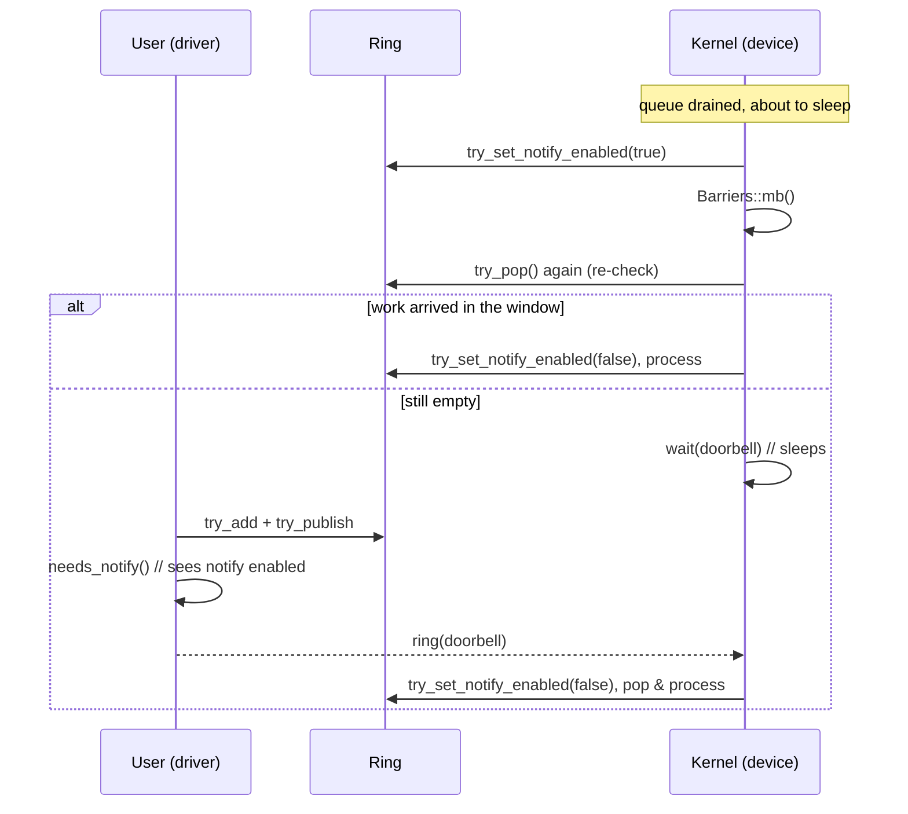
```mermaid
sequenceDiagram
  participant U as User (driver)
  participant R as Ring
  participant K as Kernel (device)
  Note over K: queue drained, about to sleep
  K->>R: try_set_notify_enabled(true)
  K->>K: Barriers::mb()
  K->>R: try_pop() again (re-check)
  alt work arrived in the window
    K->>R: try_set_notify_enabled(false), process
  else still empty
    K->>K: wait(doorbell)   // sleeps
    U->>R: try_add + try_publish
    U->>U: needs_notify()  // sees notify enabled
    U-->>K: ring(doorbell)
    K->>R: try_set_notify_enabled(false), pop & process
  end
```

Because the driver's `needs_notify()` issues `mb()` between publishing and
reading the flag, and the device issues `mb()` between enabling and re-checking,
at least one of them observes the other's store; this is what closes the
lost-wake-up window. The same pattern, mirrored, covers the completion path
(`try_set_interrupts_enabled(true)` → `mb` → `try_get_used()` re-check →
`wait`).

Device loop (kernel service / worker thread).

**What this is, and why.** It is the rule above turned into code: do all the work
that is available, *then* announce "wake me if more arrives", re-check once (the
re-check catches work that arrived during the announcement), and only then
sleep. Skipping the re-check is the classic bug: the peer publishes just before
you announce, sees "no kick wanted", and you sleep forever on a full queue.

```cpp
while (running) {                                      // running: your shutdown flag; set it, then ring kick_doorbell
  while (auto p = pop_next(kq)) {                      // drain; pop_next wraps kq.try_pop(segs), empty when idle
    handle(**p);                                       // your handler; `written` = bytes it wrote to writable buffers
    (void)kq.try_push_used(**p, written);              // (chain, bytes written)
    if (auto i = kq.should_interrupt(); i && *i) irq_doorbell.ring();   // wake the driver only if it asked
  }
  (void)kq.try_set_notify_enabled(true);               // true = "kick me when work arrives" (about to sleep).
                                                       // false = "don't kick" (awake). Issues NO barrier itself.
  smp_virtq_barriers::mb();                            // full fence: order the enable before the re-check
  if (auto p = pop_next(kq)) { (void)kq.try_set_notify_enabled(false); handle_one(**p); continue; }
  kick_doorbell.wait();                                // your wake primitive (eventfd/semaphore/futex); must be
                                                       // counted/latched so a ring before wait() isn't lost
  (void)kq.try_set_notify_enabled(false);
}
```

Driver (user) loop: submit, `needs_notify()` → `kick_doorbell.ring()`; to wait for
completions: reap until empty → `try_set_interrupts_enabled(true)` → `mb()` →
reap again → if still nothing `irq_doorbell.wait()` → `try_set_interrupts_enabled(false)`.

This exact scheme was exercised in a two-thread stress test (200 000 requests,
queue size 8, tight submit/complete interleaving; split ring; counting
doorbells on both sides): no lost wake-ups, no deadlock, neither side broken.

Practical choices:

| Concern | Recommendation |
|---|---|
| Wake-up primitive | `eventfd` (user↔kernel, or user↔user across processes), futex on a word in the region, or a kernel wait queue. A futex word placed *in the shared region* must never be trusted by the kernel (user can write anything). |
| Throughput | Leave notifications **suppressed while busy**: keep `notify`/`interrupt` disabled when the peer is actively polling and enable them only before sleeping (the loop above). With EVENT_IDX, coalesce via `try_set_used_event(last_used + n)`. |
| Latency | Spin/poll for a short bounded time before the enable→sleep sequence. |
| Fairness / DoS | The device must bound work per wake-up (budget N chains, then yield); a hostile driver can keep the ring full. |
| Backpressure | `try_add` fails when the ring has no free descriptors; the driver should reap, then retry or wait on the completion doorbell. |
| Teardown | On `is_broken()` or a failed `try_pop`, stop servicing the queue, ring the completion doorbell so the peer unblocks, and release the region. Do not "repair" and continue. |
| Crash of peer | The doorbell never rings. Use a liveness mechanism outside the ring (process exit notification, timeout on `wait`). The ring state is never trusted after the peer is gone. |

### 7.3 Event queues (kernel → user and user → kernel)

A virtqueue is request/response, but the *direction of data flow* is chosen by
which descriptors you use, so asynchronous event channels fall out naturally.
This is the same pattern as virtio-input / virtio-vsock `eventq`. Use **one
virtqueue per direction**:

| Queue | Data flows | Driver (user) posts | Device (kernel) does | Completion means |
|---|---|---|---|---|
| `eventq` | kernel → user | **empty writable** slots (`in` only), pre-armed | pops a slot *only when an event occurs*, writes the event, completes with `len = sizeof(event)` | "an event is in slot `token`" |
| `cmdq` | user → kernel | **readable** buffer (`out` only) holding a command | pops, copies the command out, handles it, completes with `len = 0` | "slot `token` is free for reuse" |

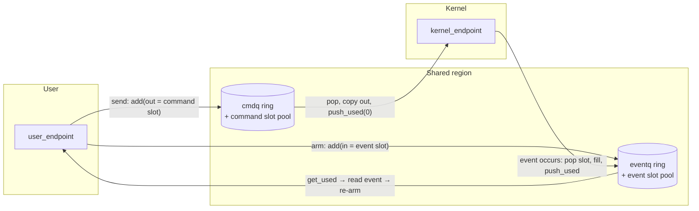
```mermaid
flowchart LR
  subgraph User
    ua["user_endpoint"]
  end
  subgraph Region["Shared region"]
    eq[("eventq ring<br/>+ event slot pool")]
    cq[("cmdq ring<br/>+ command slot pool")]
  end
  subgraph Kernel
    ka["kernel_endpoint"]
  end
  ua -- "arm: add(in = event slot)" --> eq
  ka -- "event occurs: pop slot, fill, push_used" --> eq
  eq -- "get_used → read event → re-arm" --> ua
  ua -- "send: add(out = command slot)" --> cq
  cq -- "pop, copy out, push_used(0)" --> ka
```

Design rules that make it safe and robust:

- **The kernel never waits for user space.** If the user has not re-armed a slot,
  `try_pop` returns "empty" and the event is *dropped and counted*; the count is
  reported in the next delivered event (`event::dropped`). A slow or hostile
  user can therefore lose events but can never stall or exhaust the kernel.
  (If loss is unacceptable, coalesce state-style events instead of queuing them.)
- **Slot = token.** The user passes the slot index as the token; it indexes a
  fixed pool in the shared region (`event_slot(i)`, `cmd_slot(i)`), so a
  completion identifies its buffer with no allocation.
- **Re-arm immediately.** After handling a delivered event the user re-adds the
  same slot, keeping `queue_size` slots outstanding. Publish once per batch.
- **The kernel validates every chain** the user armed: `writable[0].len` must be
  at least `sizeof(event)`; otherwise the slot is completed with `len = 0` and
  ignored (or the queue is torn down). Commands are *copied out*
  (`try_read_object`) before use.
- **Notifications:** user → kernel kicks apply to `cmdq` (and to re-arming
  `eventq`, which the kernel normally leaves suppressed because it only pops on
  its own events). Kernel → user interrupts apply to `eventq` completions. Use
  the sleep/wake protocol of [7.2](#72-synchronization-scheme) on the user's
  `eventq` wait and on the kernel's `cmdq` service loop.

Sequence for one event and one command:

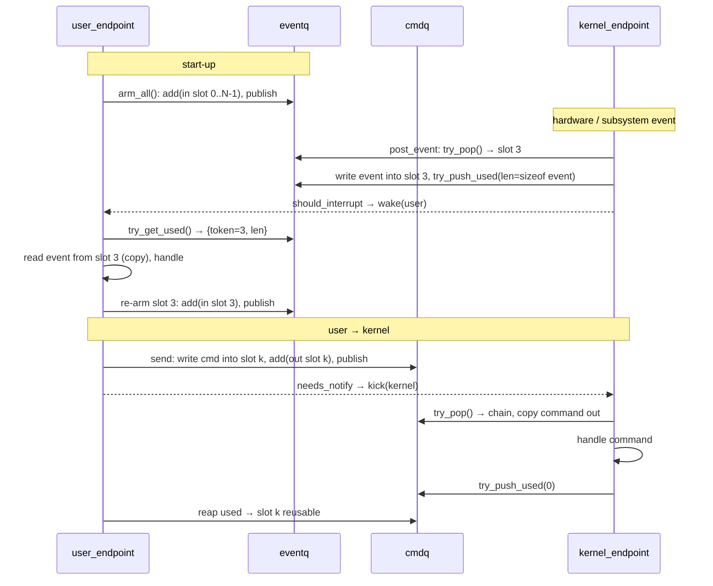
```mermaid
sequenceDiagram
  participant U as user_endpoint
  participant EQ as eventq
  participant CQ as cmdq
  participant K as kernel_endpoint
  Note over U,EQ: start-up
  U->>EQ: arm_all(): add(in slot 0..N-1), publish
  Note over K: hardware / subsystem event
  K->>EQ: post_event: try_pop() → slot 3
  K->>EQ: write event into slot 3, try_push_used(len=sizeof event)
  K-->>U: should_interrupt → wake(user)
  U->>EQ: try_get_used() → {token=3, len}
  U->>U: read event from slot 3 (copy), handle
  U->>EQ: re-arm slot 3: add(in slot 3), publish
  Note over U,K: user → kernel
  U->>CQ: send: write cmd into slot k, add(out slot k), publish
  U-->>K: needs_notify → kick(kernel)
  K->>CQ: try_pop() → chain, copy command out
  K->>K: handle command
  K->>CQ: try_push_used(0)
  U->>CQ: reap used → slot k reusable
```

Implementation (compiled and run; a split ring is used, but because the code is
written against `virtq_*_ref` handles, a packed ring is a drop-in replacement).

**What this is, and why.** A virtqueue is "driver submits, device answers", so
how do you get *unsolicited* messages from the device (a key was pressed, a
connection dropped)? The driver pre-posts empty buffers ("here are slots you may
fill when something happens"). When an event occurs, the device takes one slot,
writes the event in it and completes it, so completion = event delivery. The
driver then immediately re-posts that slot. The opposite direction (user →
kernel commands) is an ordinary queue where the driver posts a filled buffer and
the device completes it with length 0. Two small classes, `kernel_endpoint` and
`user_endpoint`, hide all queue handling from the rest of the program.

```cpp
struct event   { std::uint32_t type; std::uint32_t dropped; std::uint64_t data; }; // kernel -> user
                 // type, data: yours to define; dropped: events lost since the previous delivered one
struct command { std::uint32_t op;   std::uint32_t arg; };                          // user -> kernel

// Address of cell i in the event pool / command pool (kEventPool, kCmdPool = pool base addresses).
// The slot index i doubles as the queue token, so a completion tells you which cell it was.
constexpr addr event_slot(std::uintptr_t i) { return addr{kEventPool + i * sizeof(event)}; }
constexpr addr cmd_slot  (std::uintptr_t i) { return addr{kCmdPool   + i * sizeof(command)}; }

// ---- kernel: producer of events, consumer of commands ----------------------
class kernel_endpoint {
public:
  // m = kernel's memory backend; eventq/cmdq = device handles for the two rings
  kernel_endpoint(mem &m, virtq_device_ref<shm> eventq, virtq_device_ref<shm> cmdq) noexcept;

  // Any kernel context that detects an event (caller serialises: single producer). Never blocks.
  // Returns false ONLY if the queue is broken (tear down); true also when the event was dropped+counted.
  bool post_event(std::uint32_t type, std::uint64_t data) noexcept {
    auto p = eventq_.try_pop(segs_.as_span());
    if (!p) return false;                          // queue broken: tear down
    if (!*p) { ++dropped_; return true; }          // no armed slot: drop + count
    auto &c = **p;
    if (c.writable.empty() || c.writable[0].len < sizeof(event)) {
      (void)eventq_.try_push_used(c, 0);           // malformed arm: ignore the slot
      return true;
    }
    event ev{type, dropped_, data};
    dropped_ = 0;
    if (!try_write_object(*mem_, c.writable[0].addr, ev)) return false;
    if (!eventq_.try_push_used(c, sizeof ev)) return false;
    if (auto i = eventq_.should_interrupt(); i && *i) wake_user();
    return true;
  }

  // h = callable taking a COPIED command. Returns true when drained, false if the ring is broken.
  template <typename Handler> bool service_commands(Handler &&h) noexcept {
    for (;;) {
      auto p = cmdq_.try_pop(segs_.as_span());
      if (!p) return false;
      if (!*p) return true;                        // drained
      auto &c = **p;
      if (c.readable.empty() || c.readable[0].len < sizeof(command)) return false;
      auto cmd = try_read_object<command>(*mem_, c.readable[0].addr); // copy-out (TOCTOU)
      if (!cmd) return false;
      h(*cmd);
      if (!cmdq_.try_push_used(c, 0)) return false;   // len 0: a command's completion carries no data back
    }
  }
  // ...
};

// ---- user: consumer of events, producer of commands ------------------------
class user_endpoint {
public:
  bool arm_all() noexcept {                        // once, at start-up: post EVERY slot as an empty writable
                                                   // buffer; with none armed the kernel can only drop events
    for (std::uintptr_t i = 0; i < eventq_.queue_size(); ++i)
      if (!arm(i)) return false;
    return eventq_.try_publish().has_value();
  }

  // h = callable taking a COPIED event; every slot is re-armed after use
  template <typename Handler> bool poll_events(Handler &&h) noexcept {
    bool rearmed = false;
    for (;;) {
      auto u = eventq_.try_get_used();
      if (!u) return false;
      if (!*u) break;
      const auto slot = (*u)->token;               // token == slot index
      if ((*u)->len == sizeof(event)) {
        auto ev = try_read_object<event>(*mem_, event_slot(slot));
        if (!ev) return false;
        h(*ev);
      }
      if (!arm(slot)) return false;                // re-arm the same slot
      rearmed = true;
    }
    return !rearmed || eventq_.try_publish().has_value();
  }

  bool send(command c) noexcept {                  // false = back-pressure (no free descriptor) or error
    reap_commands();                               // recycle completed slots
    if (cmdq_.free_descriptors() == 0) return false;   // backpressure
    const std::uintptr_t slot = next_cmd_++ % kQ;
    if (!try_write_object(*mem_, cmd_slot(slot), c)) return false;
    reloco::array<sg, 1> out{{sg{cmd_slot(slot), sizeof c}}};
    if (!cmdq_.try_add(reloco::span<const sg>(out.data(), 1), {}, slot)) return false;
                                                   // (readable buffers, writable buffers, token): a command is
                                                   // readable-only, so the writable span is empty
    if (!cmdq_.try_publish()) return false;
    if (auto n = cmdq_.needs_notify(); n && *n) kick_kernel();
    return true;
  }

private:
  bool arm(std::uintptr_t slot) noexcept {
    reloco::array<sg, 1> in{{sg{event_slot(slot), sizeof(event)}}};
    return eventq_.try_add({}, reloco::span<const sg>(in.data(), 1), slot).has_value();
                                                   // empty readable span + one writable buffer = an armed event slot
  }
  // ...
};
```

Setup creates two rings in the shared region (distinct bases, same `shm`
space) and wraps each side's own mapping. **Why two queues:** a queue is
asymmetric (one submitter, one consumer), so each direction needs its own.

```cpp
// Two rings in the shared region: distinct bases so they don't overlap, same `shm` space.
// (Two queues because one queue has one submitter and one consumer: each direction needs its own.)
auto ea = split_ring_addrs<shm>::try_from_contiguous(addr{kBase},          *layout);   // event ring
auto ca = split_ring_addrs<shm>::try_from_contiguous(addr{kBase + 0x2000}, *layout);   // command ring
// edrv/cdrv, edev/cdev = event/command driver and device objects, created with try_create as in 1.3
// user:   drv_t::try_create(umem, *ea, kQ, ...), drv_t::try_create(umem, *ca, kQ, ...)
// kernel: dev_t::try_create(kmem, *ea, kQ),      dev_t::try_create(kmem, *ca, kQ)
// umem/kmem = each side's own mapping with the same logical base (see 7.1)
user_endpoint   user(umem, virtq_driver_ref<shm>(*edrv), virtq_driver_ref<shm>(*cdrv));
kernel_endpoint kern(kmem, virtq_device_ref<shm>(*edev), virtq_device_ref<shm>(*cdev));
```

Result of the run (queue size 8): 12 events posted against 8 armed slots deliver
8 events; after the user re-arms, the next event carries `dropped = 4`. Three
commands are received in order.

Variants:

| Need | Change |
|---|---|
| Events larger than a fixed slot | Arm slots with several `in` segments, or use a chain per event; the kernel checks `writable_bytes`. |
| Per-event variable length | Kernel returns `len < slot size`; the user trusts only `len ≤ sizeof(slot)` *after* checking it (the driver class already enforces `len ≤ writable capacity`). |
| Command with a reply | Use one chain: `out` = command, `in` = reply (a normal request/response queue). |
| Low event rate, low latency | Leave the user's interrupt enabled (default); the kernel wakes the user per event. |
| High event rate | Disable interrupts while the user is polling; re-enable via the enable → `mb` → re-check → sleep sequence in 7.2; coalesce with EVENT_IDX `try_set_used_event`. |
| Ordering guarantee | Events are delivered in completion order of `eventq`; use a sequence number in `event` if the user needs to detect loss precisely rather than just count it. |

---

## 8. Integration: two devices over a PCIe BAR

Setting: two independent PCIe functions (or a host CPU and an endpoint, or two
hosts joined by an NTB) need a message channel and have **no shared RAM**, only
a **BAR**: device B exposes a window of its own memory, and device A reaches it
with MMIO loads and stores. A virtqueue fits directly: the ring and a small data
pool live inside B's BAR, and each side uses the backend that matches how it
reaches those bytes.

```mermaid
flowchart LR
  subgraph A["Device A (initiator)"]
    aq["split_virtq_driver / device<br/>Mem = io_virtq_memory&lt;bar&gt;<br/>Barriers = pcie_bar_barriers"]
    aio["io_space_ref (mmio_space_backend)<br/>= ioremap(BAR2)"]
  end
  subgraph Link["PCIe"]
    tlp["MMIO read/write TLPs<br/>(posted writes, non-posted reads)"]
  end
  subgraph B["Device B (target)"]
    bm[("BAR2 backing memory<br/>control · reqq ring · evtq ring · pools")]
    bq["split_virtq_device / driver<br/>Mem = direct_virtq_memory&lt;bar&gt;"]
  end
  aq --> aio --> tlp --> bm
  bq --> bm
  aq -. "doorbell: MMIO write to BAR0/2 register" .-> bq
  bq -. "MSI-X (or doorbell write into A's BAR)" .-> aq
```

### 8.1 Mapping onto the architecture

| Concern | Choice |
|---|---|
| Address space | One tag `bar` = **offsets inside B's BAR2**, with a non-zero logical base (`kBar = 0x10000`; `0` is null). Both sides use `RingSpace = BufSpace = bar`. A raw PCI bus address or B-local address never appears in the queue API. |
| Where the ring lives | In **B's memory**, exposed through the BAR. B accesses it locally, A over PCIe. |
| B's `Mem` | `direct_virtq_memory<bar>` over the BAR's backing memory (SRAM/DRAM). |
| A's `Mem` | A *new backend*, `io_virtq_memory<bar>`, written once on top of the existing `io_space_ref` / `mmio_space_backend`: it implements `virtq_memory_traits` with `readN` / `writeN`. See 8.2. |
| Ordering | A's accesses cross PCIe, so A uses a `pcie_bar_barriers` policy instead of `smp_virtq_barriers`. See 8.3. |
| Kick (A → B) | An MMIO write to a doorbell register in the BAR (`io_space_ref::write`). |
| Interrupt (B → A) | MSI-X vector, or a write into a doorbell register in a BAR of A. |

BAR layout used below (all offsets relative to `kBar`):

| Offset | Content |
|---|---|
| `0x0000` | control: doorbell word (A writes the queue number), status/ready flag |
| `0x1000` | `reqq` ring (A = driver, B = device) |
| `0x3000` | `evtq` ring (B = driver, A = device) |
| `0x8000` / `0xA000` | request pool / event pool |

Two queues give a full-duplex channel with **each side acting as driver on one
queue and device on the other**, exactly like the user/kernel pair in section 7.

### 8.2 The A-side memory backend

The ring classes only need `virtq_memory_traits<Mem, Space>`. For a BAR the
natural implementation sits on the io-space layer, which already provides
volatile, width-specific, bounds-checked accessors with no implicit barriers.

**What this is, and why.** The ring classes never touch memory directly; they ask
a *backend* "load the 16-bit value at this address". For ordinary RAM that is a
`memcpy`. For a BAR it must be a real MMIO access (a PCIe transaction), so we
need a backend that performs those and that distrusts addresses coming from the
peer. You write this backend once; every ring class then works on it unchanged.

```cpp
template <typename Space, typename IoSpace = device_io_space>   // Space: address-space tag of the BAR memory
class io_virtq_memory {                                         // IoSpace: tag selecting the MMIO accessor type
public:
  // io   = io_space_ref over the mapped BAR window
  // base = logical address of BAR offset 0;  size = BAR size in bytes
  io_virtq_memory(io_space_ref<IoSpace> io, phys_addr<void, Space> base, std::uint64_t size) noexcept;

  // a   = address the ring code wants to touch (peer-influenced, untrusted)
  // len = bytes it will access
  // returns the offset inside the window, or out_of_range.
  // Fold the bounds check into one boolean and mask the offset with
  // nospec::sanitize (returns `off` if ok, else 0, with no branch the CPU can
  // speculate past) BEFORE the failing branch.
  reloco::result<std::uint64_t> offset(phys_addr<void, Space> a, std::uint64_t len) const noexcept {
    const std::uint64_t off = a.value - base_.value;
    const bool ok = (a.value >= base_.value) & (off <= size_) & (size_ - off >= len);
    const std::uint64_t safe = reloco::nospec::sanitize(off, ok, std::uint64_t{0});
    if (!ok) return reloco::unexpected(reloco::error::out_of_range);
    return safe;
  }
  io_space_ref<IoSpace> io() const noexcept { return io_; }
  // ...
};

template <typename Space, typename IoSpace>
struct virtq_memory_traits<io_virtq_memory<Space, IoSpace>, Space> {
  // try_load16 / try_store16: aligned 16-bit ring index/flags access:
  //                           offset(), alignment check, io().read/write(io_address<uint16_t,...>)
  // try_read / try_write:     bulk copy: offset(), then the widest aligned access that fits
  //                           (32-bit when aligned and >= 4 bytes remain, else 8-bit)
};
```


Points that matter:

- **The nospec masking is not optional.** `mmio_space_backend` bounds-checks the
  window but does not mask the offset against speculation, and the offsets here
  come from the *peer's* descriptors. The backend must do it itself
  (rule from `virtq_memory.hpp`).
- **A out-of-BAR descriptor from B** (B is the untrusted peer for A's device
  queue) fails with `out_of_range` instead of becoming a wild MMIO access.
- **Use wide, aligned accesses.** Every non-posted read is a PCIe round trip
  (hundreds of ns to µs); a descriptor is read as 4 × 32-bit, not 16 × 8-bit.
- Still **copy-out only**: nothing returns a pointer into the BAR, so the
  TOCTOU rules hold even though the memory is "device memory".
- Wrapping the backend in `virtq_memory_ref<bar>` (section 5) is fine if A's code
  must also run against a plain-RAM ring (tests, or a shared-RAM transport).

If the BAR is reached from a DMA-capable *device* (peer-to-peer) rather than a
CPU, the same structure applies; only the backend changes (a DMA engine or P2P
window instead of `ioremap`), plus an address step: use a `phys_translator`
(`translating_virtq_memory`) from the initiator's PCI bus address space to the
`bar` offset space so the BAR window base/size is enforced in one place.

### 8.3 Ordering across PCIe

The default `smp_virtq_barriers` fences are about CPU cache coherence. Across a
BAR you additionally need the PCIe/write-combining rules, so supply your own
policy (the `Barriers` template parameter exists for exactly this).

**What this is, and why.** A *barrier* is an instruction that says "everything I
did before this must become visible before anything I do after this". The ring
protocol is correct only if, for example, the descriptor contents are visible
to the peer *before* the index that announces them. Normal CPU-to-CPU fences
don't cover traffic that goes out over a bus (PCIe writes can sit in buffers),
so on this path you must use the stronger fences below.

```cpp
struct pcie_bar_barriers {                       // A side only (the side that goes over the bus)
  // wmb: before publishing, make all earlier WRITES (descriptors, payload) visible to the peer first
  static void wmb() noexcept { arch::x86::barrier_traits::hw_write_barrier(); } // SFENCE: drain WC buffers,
                                                                                 // keep posted writes ordered
  // rmb: between reading an index and reading the entries it covers
  static void rmb() noexcept { arch::x86::barrier_traits::hw_read_barrier();  }
  // mb: full fence, used for "enable notification, then re-check" (7.2) and the needs_notify decision
  static void mb()  noexcept { arch::x86::barrier_traits::hw_full_barrier();  }
  // other architectures: structo::arch::{arm,arm64,riscv}::barrier_traits
};
// 4th template argument = barrier class (default smp_virtq_barriers); only A needs the stronger one.
// `bar` = address-space tag of the BAR memory, shared by both queues.
using a_driver = split_virtq_driver<bar, bar, io_virtq_memory<bar>, pcie_bar_barriers>;
using b_device = split_virtq_device<bar, bar, direct_virtq_memory<bar>>;  // default smp barriers
```


Why this is sufficient:

- PCIe keeps **posted writes from one requester in order** and a **read cannot
  pass an earlier posted write**. So "descriptor writes → `wmb` → `avail.idx`
  write → doorbell write" arrives at B in that order, provided all of them use
  the same mapping type (uncached, or write-combining with `wmb` between them).
- The notify decision in `needs_notify()` (store `avail.idx`, then load
  `used.flags`) relies on a full barrier; on the A side that is `mb()`, and
  because the load is a non-posted read it also forces the earlier posted
  writes out to B.
- **B's side** is ordinary coherent memory written by an external bus master, so
  the default `smp_virtq_barriers` is correct there (B's CPU/firmware sees A's
  writes through its coherent interconnect; if B is a non-coherent
  accelerator, give it a policy with the right cache maintenance).
- Do **not** map the ring as write-combining without `wmb` between the
  descriptor stores and the index store: WC buffers may flush out of order.
  Prefer an uncached mapping for the control and ring pages and WC only for large
  data pools, flushed with `wmb` before the avail index is published.

### 8.4 Setup and handshake

1. **B** zeroes its BAR memory, builds `split_ring_addrs` from the fixed layout
   (`try_from_contiguous`), calls `try_create` for the queues it drives
   (`evtq` driver) and for the ones it serves (`reqq` device), then sets a
   *ready* flag in the control page.
2. **A** waits for *ready* (poll or MSI-X), then builds the same addresses (they
   come from the BAR layout, not from B's runtime data) and calls `try_create`.
   The driver `try_create` initialises the ring over MMIO, so B must **not**
   touch `reqq` until A signals; device `try_create` does not write.
3. Queue size and layout are a compile-time or negotiated constant; never read
   them from B-writable memory after the handshake.
4. On a link-down / surprise removal, every MMIO read returns all-ones. The ring
   classes mostly reject that already: an all-ones index normally implies more
   outstanding entries than the ring holds, and all-ones ids/lengths fail the
   range and capacity checks, so the queue latches `is_broken()`. That is not
   guaranteed for every value, so also treat a vendor-ID read-back of all-ones
   as the authoritative "device gone" signal.

### 8.5 One request and one notice

**What this is, and why.** This is the whole channel end to end: A sends a request
and gets an answer (A drives `reqq`), then B sends a notice to A (B drives
`evtq`). Read it as two halves of one conversation where the only difference
from section 7 is *how each side touches the bytes*: B uses plain loads/stores,
A uses MMIO through `io_virtq_memory`. The ring code is identical.

```cpp
// ---- layout ----   (all constants are logical addresses inside the BAR; every offset is relative to kBar)
struct bar {};  using addr = phys_addr<void, bar>;  using sg = sg_entry<bar, std::uint64_t>;
constexpr std::uint64_t kBar = 0x10000,           // address of BAR offset 0
                        kDoorbell = kBar,         // register A writes to wake B
                        kReqRing = kBar + 0x1000, // request ring: desc/avail/used back to back
                        kEvtRing = kBar + 0x3000, // event ring (must not overlap the request ring)
                        kReqPool = kBar + 0x8000, // payload buffers for the request queue
                        kEvtPool = kBar + 0xA000; // payload buffers for the event queue

// ---- B (target): direct access to its own BAR memory ----
// (bar_ram = B's local pointer to the BAR memory, bar_size = its size, kBar = logical base)
direct_virtq_memory<bar> b_mem(bar_ram, bar_size, addr{kBar});
// ---- A (initiator): the same memory through an ioremap'd window ----
mmio_space_backend bar_window(bar_mapping, bar_size);          // bounds-checked accessor over A's ioremap(BAR2) pointer
io_space_ref<device_io_space> bar_io(bar_window);
io_virtq_memory<bar> a_mem(bar_io, addr{kBar}, bar_size);      // (MMIO accessor, logical base, size)

auto req = split_ring_addrs<bar>::try_from_contiguous(addr{kReqRing}, *layout);
auto evt = split_ring_addrs<bar>::try_from_contiguous(addr{kEvtRing}, *layout);

// reqq: A drives, B serves          evtq: B drives, A serves
// kQ = queue size; a_slots / b_slots = each DRIVER's own bookkeeping array (A drives reqq, B drives evtq)
auto a_req = split_virtq_driver<bar, bar, decltype(a_mem), pcie_bar_barriers>::try_create(a_mem, *req, kQ, a_slots);
auto b_req = split_virtq_device<bar, bar, decltype(b_mem)>::try_create(b_mem, *req, kQ);
auto b_evt = split_virtq_driver<bar, bar, decltype(b_mem)>::try_create(b_mem, *evt, kQ, b_slots);
auto a_evt = split_virtq_device<bar, bar, decltype(a_mem), pcie_bar_barriers>::try_create(a_mem, *evt, kQ);

// ---- A -> B: request (MMIO writes, then one doorbell write) ----
// out_sg / in_sg = sg{addr, len} lists: device-readable buffers first, device-writable second
(void)try_write_object(a_mem, addr{kReqPool}, request{7, 21});          // payload into B's BAR (any trivially copyable type)
(void)a_req->try_add(out_sg, in_sg, /*token=*/1);                        // descriptors via MMIO; token = your cookie
(void)a_req->try_publish();                                              // wmb, avail.idx via MMIO
if (auto n = a_req->needs_notify(); n && *n)                             // mb + read used.flags / avail_event
  (void)bar_io.write(io_address<std::uint32_t, device_io_space>{kDoorbell - kBar}, 0u);
                                                                         // typed 32-bit register at BAR offset
                                                                         // (kDoorbell - kBar); value 0 = queue 0

// ---- B, on the doorbell (all local accesses) ----
auto p  = b_req->try_pop(b_segs.as_span());
auto rq = try_read_object<request>(b_mem, (**p).readable[0].addr);       // copy-out, then validate
(void)try_write_object(b_mem, (**p).writable[0].addr, rq->arg * 2);
(void)b_req->try_push_used(**p, 4);
if (auto i = b_req->should_interrupt(); i && *i) raise_msix_to_a();       // raise_msix_to_a(): your function that triggers A's MSI-X

// ---- A, on the MSI-X ----
auto u = a_req->try_get_used();                                          // used.idx / element over PCIe
auto r = try_read_object<std::uint32_t>(a_mem, addr{kReqPool + 32});

// ---- B -> A: notice. B is the DRIVER of evtq, A the DEVICE ----
(void)try_write_object(b_mem, addr{kEvtPool}, notice{3, 99});            // local write
(void)b_evt->try_add(notice_sg, {}, /*token=*/2);                        // out-only chain
(void)b_evt->try_publish();
if (auto n = b_evt->needs_notify(); n && *n) raise_msix_to_a();          // or doorbell into A's BAR
auto e  = a_evt->try_pop(a_segs.as_span());                              // A reads B's ring over PCIe
auto nt = try_read_object<notice>(a_mem, (**e).readable[0].addr);       // A reads the payload over PCIe
(void)a_evt->try_push_used(**e, 0);                                      // A writes used elem/idx over PCIe
```


```mermaid
sequenceDiagram
  participant A as Device A (initiator)
  participant L as PCIe
  participant B as Device B (BAR owner)
  Note over B: zero BAR memory, create queues, set READY
  A->>L: MMIO write: request payload → pool
  A->>L: MMIO write: descriptors, avail.ring[]
  A->>L: SFENCE (wmb), MMIO write: avail.idx
  A->>L: MFENCE (mb), MMIO read: used.flags (flushes posted writes)
  A->>L: MMIO write: doorbell
  L->>B: doorbell register written
  B->>B: try_pop (local), read request, write response
  B->>B: try_push_used (local), should_interrupt
  B-->>A: MSI-X
  A->>L: MMIO read: used.idx, used elem, response
  Note over A,B: reverse direction: B drives evtq locally, A pops it with MMIO reads and completes with MMIO writes
```

### 8.6 Design guidance specific to BARs

| Topic | Guidance |
|---|---|
| **Put the ring next to its busiest reader.** | A BAR read from the CPU costs a full PCIe round trip; a write is posted and cheap. In a split ring the device reads `avail`/descriptors and the driver reads `used`. Placing the ring in B's memory makes B's reads free and A's reads (used index, completions) expensive. For a **high-rate** B→A direction, prefer making **A the owner of that queue's memory** (expose A's BAR / use host RAM) so the consumer reads locally and the producer does the cheap posted writes. Rule of thumb: *the consumer of a ring should own its memory*. |
| **Cut round trips.** | Batch: one `try_publish` and one `needs_notify` per batch; reap with a bounded loop; enable EVENT_IDX and `try_set_used_event(last_used + n)` to coalesce interrupts. A packed ring (one ring, one cache-line-sized descriptor) usually needs fewer reads per request than split. |
| **Large payloads.** | Don't copy megabytes through MMIO. Keep the *ring* in the BAR and make `BufSpace` the initiator's **PCI bus address space**: descriptors carry bus addresses of buffers in A's RAM, and B reads/writes them with its DMA engine (`virtq_memory_traits<dma_mem, pci_bus>` for B's buffer memory, via `try_read_chain` / `try_write_chain`). `RingSpace` (`bar`) and `BufSpace` (`pci_bus`) are different tags, so the two can never be confused. B must translate with the IOMMU (`phys_translator`) and bound every buffer. |
| **Both sides hostile.** | Each side treats the other as untrusted (section 11): A is the *device* on `evtq` and validates B's chains; B is the device on `reqq` and validates A's. Because A's backend masks BAR offsets and B's `direct_virtq_memory` masks window offsets, a corrupt descriptor can neither read outside the BAR nor out of B's memory. |
| **Bad link behaviour.** | MMIO reads of a dead link return all-ones and may stall for the completion timeout. Bound the work per call, never spin forever on an index, and surface `is_broken()` to a supervisor that resets the queue pair via the control page. |
| **Sizing.** | A split ring of `N` entries needs `16·N + 6 + 2·N` (descriptors + avail) plus `6 + 8·N` (used) bytes with alignment; `try_split_layout(N, ...)` gives the exact figures, so size the BAR from it plus the pools. |
| **Testing without hardware.** | `direct_virtq_memory` over a `std::byte[]` on both sides, with `mmio_space_backend` over the *same array* for A, runs the whole protocol in one process (this is how section 7's examples run). |

---

## 9. Linux and FreeBSD guests on one side, structo on the other

**What this is, and why.** Most real virtio traffic has a Linux or FreeBSD
guest on one end. Both ship a mature *driver-side* API (Linux `virtqueue_*`,
FreeBSD `virtqueue_*` plus `sglist(9)`) and a virtio-mmio/virtio-pci
*transport*. structo's device classes can sit on the other end (a VMM, a
firmware device, a user-space backend) and speak to an unmodified guest. This
section maps these APIs onto structo's, with a Linux and a FreeBSD driver for
each example (9.3 and 9.3.1, 10.3 and 10.3.1).

> The Linux and FreeBSD snippets below are **illustrative** (written from the
> in-tree APIs, not built here; names and signatures change between kernel
> versions, notably Linux `virtio_find_vqs`). The structo snippets were
> compiled with
> `-Wall -Wextra -Wpedantic -Wshadow -Wconversion` and run under
> ASan/UBSan against a simulated guest that performs the Linux handshake.
> The registers below are implemented in the library for split rings as
> `virtio/virtio_mmio.hpp` (`virtio_mmio_device`, pluggable into
> `hypervisor::mmio_device_ref`) with a block function in
> `virtio/virtio_blk.hpp`; the hand-written model in 9.4 shows what that
> transport does internally and remains the template for other device types.

### 9.1 Overview

```mermaid
flowchart LR
  subgraph Guest["Linux guest"]
    D["your virtio_driver"] --> V["virtqueue_add_sgs / kick / get_buf"]
    V --> T["virtio_mmio transport"]
  end
  RAM[("guest RAM: desc / avail / used")]
  subgraph VMM["structo (VMM)"]
    M["mmio_device_traits (registers)"] --> Q["split_virtq_device"]
  end
  V <--> RAM
  Q <--> RAM
  T -- "MMIO write QueueNotify (exit)" --> M
  M -- "inject IRQ + InterruptStatus" --> T
```

### 9.2 API mapping

| Linux (driver side) | structo (device side) / meaning |
|---|---|
| `virtqueue_add_sgs(vq, sgs, out, in, data, gfp)` | Guest posts a chain; device sees it from `try_pop`. Out sgs = `readable`, in sgs = `writable`. `data` is guest-private; structo's `try_add` token plays that role when structo is the driver. |
| `virtqueue_kick(vq)` | Guest writes `QueueNotify` (MMIO exit). Your register handler calls the queue service routine. |
| `virtqueue_get_buf(vq, &len)` | Guest reaps what `try_push_used(chain, len)` published. |
| `virtqueue_disable_cb` / `virtqueue_enable_cb` | Guest-side interrupt suppression. Device honours it via `should_interrupt()` (same enable → re-check protocol as 7.2). |
| `vq callback` (IRQ) | You inject an IRQ and set `InterruptStatus` bit 0 when `should_interrupt()` is true; the guest clears it with `InterruptACK`. |
| `virtio_has_feature` / `driver.feature_table` | Feature words exchanged through `DeviceFeatures` / `DriverFeatures`; check with `has_feature`. |
| `virtio_cread` / `virtio_cwrite` | Reads/writes at register offset `0x100+`. |
| `virtio_device_ready()` | Guest sets `DRIVER_OK` in `Status`. |

### 9.3 Linux guest driver (sketch)

**What this is:** a minimal driver for a private "echo" device. It sends a
string and the device writes it back. **Why:** shows exactly which Linux calls
generate the descriptors the structo device later pops.

```c
#include <linux/module.h>
#include <linux/virtio.h>
#include <linux/virtio_config.h>
#include <linux/scatterlist.h>
#include <linux/slab.h>

#define ECHO_DEVICE_ID 0x4242 /* private; real IDs are assigned by OASIS */
/* id_table = which devices this driver binds to: {device id, vendor}; VIRTIO_DEV_ANY_ID matches any vendor.
   MODULE_DEVICE_TABLE (bottom) exports it so the module autoloads. */
static const struct virtio_device_id id_table[] = { { ECHO_DEVICE_ID, VIRTIO_DEV_ANY_ID }, { 0 } };

struct echo { struct virtqueue *vq; char *req, *rsp; struct completion done; };

static void echo_done(struct virtqueue *vq) {            /* IRQ callback */
  struct echo *e = vq->vdev->priv; unsigned int len;
  while (virtqueue_get_buf(vq, &len)) complete(&e->done); /* reap used entries: returns the `data` cookie of a
                                                             completed chain (NULL = none); len = bytes the device wrote */
}

static int echo_probe(struct virtio_device *vdev) {
  struct echo *e = kzalloc(sizeof *e, GFP_KERNEL);
  struct scatterlist out, in, *sgs[2] = { &out, &in };
  int err;
  if (!e) return -ENOMEM;
  e->req = kzalloc(64, GFP_KERNEL);                      /* must be DMA-able: kmalloc, not stack/vmalloc */
  e->rsp = kzalloc(64, GFP_KERNEL);
  init_completion(&e->done);
  vdev->priv = e;
  e->vq = virtio_find_single_vq(vdev, echo_done, "echo");
  /* (vdev, cb, name): vdev = the device; cb = IRQ callback run when the device completes buffers
     (NULL if you poll); name = label in /proc/interrupts. Allocates the ring and programs the
     transport's Queue* registers; returns the virtqueue or an ERR_PTR.
     Newer kernels: virtio_find_vqs + struct virtqueue_info. */
  if (IS_ERR(e->vq)) return PTR_ERR(e->vq);
  virtio_device_ready(vdev);                              /* sets DRIVER_OK: call after the queues exist, before use */

  strcpy(e->req, "ping from guest");
  sg_init_one(&out, e->req, 64);                          /* (sg, ptr, len): one descriptor over a kmalloc'ed buffer;
                                                             device-readable first */
  sg_init_one(&in, e->rsp, 64);                           /* then device-writable */
  err = virtqueue_add_sgs(e->vq, sgs, 1, 1, e, GFP_KERNEL);
  /* (vq, sgs, out_num, in_num, data, gfp): sgs = array with the out_num device-READABLE entries first, then
     in_num device-WRITABLE; data = cookie handed back by virtqueue_get_buf (structo's "token");
     gfp = allocation flags (used for indirect tables). Returns 0 or e.g. -ENOSPC if the ring is full. */
  if (err) return err;
  virtqueue_kick(e->vq);                                  /* publish; writes QueueNotify only if the device wants it */
  wait_for_completion(&e->done);
  pr_info("echo: %s\n", e->rsp);
  return 0;
}

static void echo_remove(struct virtio_device *vdev) {
  virtio_reset_device(vdev);                              /* stop the device first ... */
  vdev->config->del_vqs(vdev);                            /* ... then free the rings */
}

static struct virtio_driver echo_driver = {
  .driver.name = "echo", .id_table = id_table, .probe = echo_probe, .remove = echo_remove,
};
module_virtio_driver(echo_driver);
MODULE_DEVICE_TABLE(virtio, id_table);
MODULE_LICENSE("GPL");
```


Tell the guest the device exists, either with a device-tree node
(`compatible = "virtio,mmio"; reg = <base size>; interrupts = <...>;`) or on
the kernel command line: `virtio_mmio.device=0x200@0xd0000000:5`.

#### 9.3.1 FreeBSD guest driver (sketch)

**What this is:** the same private "echo" driver for FreeBSD. **Why:** a
FreeBSD guest produces exactly the same descriptors, so the structo device
model in 9.4 serves both unchanged. Only the guest-side calls differ:

| Linux | FreeBSD (`dev/virtio/virtqueue.h`, `sglist(9)`) |
|---|---|
| `virtio_driver` + `module_virtio_driver` | newbus `driver_t` + `VIRTIO_DRIVER_MODULE` (attaches under `virtio_mmio` and `virtio_pci`) |
| `virtio_find_single_vq(vdev, cb, name)` | `VQ_ALLOC_INFO_INIT` + `virtio_alloc_virtqueues` + `virtio_setup_intr` |
| `sg_init_one` + `virtqueue_add_sgs` | `sglist_append` + `virtqueue_enqueue(vq, cookie, sg, readable, writable)` |
| `virtqueue_kick` | `virtqueue_notify` |
| `virtqueue_get_buf` | `virtqueue_dequeue` |
| `virtqueue_disable_cb` / `enable_cb` | `virtqueue_disable_intr` / `virtqueue_enable_intr` |
| `virtio_device_ready` | done by the bus after attach; use `virtio_attach_completed` to act afterwards |

```c
#include <sys/param.h>
#include <sys/systm.h>
#include <sys/kernel.h>
#include <sys/module.h>
#include <sys/malloc.h>
#include <sys/bus.h>
#include <sys/lock.h>
#include <sys/mutex.h>
#include <sys/sglist.h>
#include <dev/virtio/virtio.h>
#include <dev/virtio/virtqueue.h>

#define ECHO_DEVICE_ID 0x4242            /* private; real IDs are assigned by OASIS */

struct echo_softc {
  device_t          dev;
  struct virtqueue *vq;
  struct mtx        mtx;                 /* protects the virtqueue */
  struct sglist    *sg;                  /* scratch scatter/gather list: 2 segments */
  char             *req, *rsp;           /* malloc(9) memory: the guest-physical addresses of these are what the device sees */
};

static int echo_probe(device_t dev) {
  if (virtio_get_device_type(dev) != ECHO_DEVICE_ID)   /* the DeviceID register (0x008) */
    return ENXIO;
  device_set_desc(dev, "VirtIO echo");
  return BUS_PROBE_DEFAULT;
}

static void echo_intr(void *arg) {                     /* arg = the softc passed to VQ_ALLOC_INFO_INIT; runs on the device IRQ */
  struct echo_softc *sc = arg;
  uint32_t len;                                        /* out: bytes the device wrote */
  mtx_lock(&sc->mtx);
  while (virtqueue_dequeue(sc->vq, &len) != NULL)      /* returns the cookie given to enqueue; NULL = nothing completed */
    device_printf(sc->dev, "echo: %s\n", sc->rsp);
  mtx_unlock(&sc->mtx);
}

static int echo_attach(device_t dev) {
  struct echo_softc *sc = device_get_softc(dev);
  struct vq_alloc_info vq_info;
  int error;

  sc->dev = dev;
  mtx_init(&sc->mtx, "echo", NULL, MTX_DEF);
  virtio_negotiate_features(dev, 0);                   /* (dev, features we support): offer none beyond the transport's */
  /* (info, nsegs, intr, arg, vqp, fmt, ...):
       nsegs = max scatter/gather segments per request; > 1 asks for indirect descriptors if the
               device offers them (0 = never use indirect; see the pitfalls in 9.6)
       intr  = interrupt handler for this queue, arg = its argument
       vqp   = where the allocated virtqueue pointer is stored
       fmt   = queue name, shown in interrupt statistics */
  VQ_ALLOC_INFO_INIT(&vq_info, 0, echo_intr, sc, &sc->vq, "%s request", device_get_nameunit(dev));
  error = virtio_alloc_virtqueues(dev, 0, 1, &vq_info); /* (dev, flags, number of queues, info array) */
  if (error) return error;
  error = virtio_setup_intr(dev, INTR_TYPE_MISC);      /* hooks the interrupt; the bus sets DRIVER_OK after attach */
  if (error) return error;

  sc->req = malloc(64, M_DEVBUF, M_WAITOK | M_ZERO);   /* malloc(9) memory; sglist_append resolves the physical pages */
  sc->rsp = malloc(64, M_DEVBUF, M_WAITOK | M_ZERO);
  sc->sg  = sglist_alloc(2, M_WAITOK);                 /* room for 2 segments */
  return 0;
}

static void echo_attach_completed(device_t dev) {      /* the device is now live (DRIVER_OK is set): safe to submit */
  struct echo_softc *sc = device_get_softc(dev);

  strlcpy(sc->req, "ping from guest", 64);
  sglist_reset(sc->sg);
  sglist_append(sc->sg, sc->req, 64);                  /* (sglist, kernel virtual address, length): device-readable first */
  sglist_append(sc->sg, sc->rsp, 64);                  /* then device-writable */
  mtx_lock(&sc->mtx);
  /* (vq, cookie, sglist, readable_segments, writable_segments):
       cookie   = returned by virtqueue_dequeue (structo's "token");
       readable = how many leading segments the device may READ (1: req);
       writable = how many following segments the device may WRITE (1: rsp). */
  (void)virtqueue_enqueue(sc->vq, sc, sc->sg, 1, 1);
  virtqueue_notify(sc->vq);                            /* QueueNotify if the device wants it */
  mtx_unlock(&sc->mtx);
}

static int echo_detach(device_t dev) {
  struct echo_softc *sc = device_get_softc(dev);
  virtio_stop(dev);                                    /* reset the device, then free its queues */
  if (sc->vq != NULL) virtqueue_free(sc->vq);
  if (sc->sg != NULL) sglist_free(sc->sg);
  free(sc->req, M_DEVBUF); free(sc->rsp, M_DEVBUF);
  mtx_destroy(&sc->mtx);
  return 0;
}

static device_method_t echo_methods[] = {
  DEVMETHOD(device_probe,           echo_probe),
  DEVMETHOD(device_attach,          echo_attach),
  DEVMETHOD(device_detach,          echo_detach),
  DEVMETHOD(virtio_attach_completed, echo_attach_completed),
  DEVMETHOD_END
};
static driver_t echo_driver = { "virtio_echo", echo_methods, sizeof(struct echo_softc) };
VIRTIO_DRIVER_MODULE(virtio_echo, echo_driver, NULL, NULL);
MODULE_VERSION(virtio_echo, 1);
MODULE_DEPEND(virtio_echo, virtio, 1, 1, 1);
```

Discovery is the same device-tree node (`compatible = "virtio,mmio"`) on
platforms where FreeBSD's `virtio_mmio` attaches via FDT (arm64, RISC-V); with
virtio-pci the driver is identical, only the transport differs.

### 9.4 structo device model (virtio-mmio v2)

**What this is:** the register file Linux's `virtio_mmio` driver talks to,
plus the glue to a `split_virtq_device`. **Why:** the Linux driver programs
three separate ring addresses; structo's `split_ring_addrs` takes exactly
those three, and `try_create` validates all of them before any access.

```mermaid
sequenceDiagram
  participant L as Linux virtio_mmio
  participant R as echo_device (mmio_device_traits)
  participant Q as split_virtq_device
  L->>R: read Magic/Version/DeviceID
  L->>R: Status = ACK, DRIVER
  L->>R: read DeviceFeatures[1] (VERSION_1)
  L->>R: write DriverFeatures, Status |= FEATURES_OK
  R-->>L: FEATURES_OK stays set only if features are a subset
  L->>R: QueueSel, QueueNum, Desc/Driver/Device addrs, QueueReady=1
  R->>Q: try_create(mem, split_ring_addrs, q_num)
  L->>R: Status |= DRIVER_OK
  L->>R: QueueNotify
  R->>Q: try_pop / try_push_used
  R-->>L: InterruptStatus |= 1, inject IRQ
  L->>R: InterruptACK
```

Key parts (full register switch elided; offsets: Magic `0x000`, Version
`0x004`, DeviceID `0x008`, DeviceFeatures `0x010`/Sel `0x014`, DriverFeatures
`0x020`/Sel `0x024`, QueueSel `0x030`, QueueNumMax `0x034`, QueueNum `0x038`,
QueueReady `0x044`, QueueNotify `0x050`, InterruptStatus `0x060`, InterruptACK
`0x064`, Status `0x070`, QueueDesc `0x080/84`, QueueDriver `0x090/94`,
QueueDevice `0x0a0/a4`, Config `0x100`):

```cpp
// gpa / gpa_addr = address-space tag and tagged address for GUEST-PHYSICAL addresses: every address
// the guest wrote into a register or descriptor is one.
// vmm_mem = translating_virtq_memory<GPA->HVA, direct> from section 6; `mem` below points to one.
using echo_queue = split_virtq_device<gpa, gpa, vmm_mem>;

// Feature bits this device offers. 1 << feature_version_1 = "modern, little-endian virtio only".
static constexpr std::uint64_t offered = std::uint64_t{1} << feature_version_1; // see pitfalls

// Call on QueueReady = 1, after FEATURES_OK.
//   q_desc / q_drv / q_dev = the three 64-bit addresses the guest wrote via QueueDesc*, QueueDriver*
//                            (the AVAIL ring) and QueueDevice* (the USED ring)
//   q_num                  = value of QueueNum: queue size the guest chose (<= QueueNumMax, power of two)
reloco::result<void> bring_up_queue() {
  split_ring_addrs<gpa> a{gpa_addr{q_desc}, gpa_addr{q_drv}, gpa_addr{q_dev}};
  auto q = echo_queue::try_create(*mem, a, q_num); // (memory, ring addresses, queue size): validates alignment, size, window
  if (!q) return reloco::unexpected(q.error());
  queue.emplace(*q);
  return {};
}

// Call on QueueNotify. kQueueMax = max queue size advertised in QueueNumMax; it sizes `segs`.
// `status` = the device status byte (ACK, DRIVER, FEATURES_OK, DRIVER_OK, NEEDS_RESET);
// st_needs_reset tells the guest "I hit an error, reset me".
void service() {
  reloco::array<chain_segment<gpa>, kQueueMax> segs{};   // storage for one popped chain's buffer list
  bool any = false;
  for (;;) {
    auto p = queue->try_pop(segs.as_span());
    if (!p) { status |= st_needs_reset; return; } // hostile/corrupt ring: DEVICE_NEEDS_RESET
    if (!*p) break;
    auto &c = **p;
    reloco::array<std::byte, 64> buf{};                  // local staging copy (TOCTOU-safe)
    const std::size_t n = std::min<std::size_t>({c.readable_bytes, c.writable_bytes, buf.size()}); // bytes to echo
    auto dst = buf.as_span().first(n);
    if (!try_read_chain(*mem, c.readable, 0, dst)) { status |= st_needs_reset; return; }
        // (memory, segments, start byte 0, local destination): gather guest readable buffers into `dst`
    auto src = reloco::span<const std::byte>(buf.data(), n);
    if (!try_write_chain(*mem, c.writable, 0, src)) { status |= st_needs_reset; return; }
        // (memory, segments, start byte 0, local source): scatter `src` into guest writable buffers
    if (!queue->try_push_used(c, static_cast<std::uint32_t>(n))) { status |= st_needs_reset; return; }
        // tell the guest the device wrote n bytes
    any = true;
  }
  if (any)
    if (auto i = queue->should_interrupt(); i && *i) { int_status |= 1; inject_irq(); }
        // int_status bit 0: guest reads it in InterruptStatus, clears it by writing InterruptACK;
        // inject_irq() = your platform's interrupt injection
}
```

`Status` writes are the negotiation gate: when the guest sets `FEATURES_OK`,
accept it only if `(driver_features & ~offered) == 0` and `VERSION_1` is
present; otherwise clear the bit so Linux sees the refusal and fails the
probe. Writing `0` resets everything (drop the queue, clear addresses).

Run against a simulated guest the model prints
`token=7 len=16 'ping from guest' irqs=1 status=0xf`, and a driver that
requests an unoffered feature is refused.

### 9.4.1 The library transport: `virtio_mmio_device` and `virtio_blk_function`

The model above is what `virtio/virtio_mmio.hpp` implements for you. It
handles the registers, feature negotiation, queue bring-up (split **or**
packed rings, `EVENT_IDX`, and `INDIRECT_DESC` on split rings), interrupt
status and `DEVICE_NEEDS_RESET`. It offers `RING_PACKED`, `EVENT_IDX` and
`INDIRECT_DESC` itself; a driver that negotiates PACKED together with
INDIRECT_DESC is refused at `FEATURES_OK`. You supply only the device type
(a *function*) and the guest memory backend.

```cpp
#include <structo/virtio/virtio_blk.hpp>
#include <structo/virtio/virtio_mmio.hpp>

using namespace structo; // virtio::, hypervisor::, phys_addr

struct guest_space {}; // WHAT: tag for guest-physical addresses. WHY: keeps them from mixing with host pointers.

// WHAT: a backing store for the block device. WHY: the function only knows sectors;
// where the bytes live (RAM, file, NVMe) is your decision.
struct ram_store {
  std::uint64_t capacity_sectors() const noexcept { return 2048; } // size in 512-byte sectors (1 MiB)
  bool read_only() const noexcept { return false; }               // true => offers VIRTIO_BLK_F_RO, refuses writes
  // sector: first sector; buf: bytes to fill (non-zero multiple of 512, range pre-validated)
  reloco::result<void> try_read(std::uint64_t sector, reloco::span<std::byte> buf) noexcept;
  // sector: first sector; buf: bytes to store
  reloco::result<void> try_write(std::uint64_t sector, reloco::span<const std::byte> buf) noexcept;
  reloco::result<void> try_flush() noexcept; // make previous writes durable
};

using guest_mem = virtio::direct_virtq_memory<guest_space>; // WHAT: how to reach guest memory

void create_disk(guest_mem &guest_ram, ram_store &store) {
  // WHAT: the device function. WHY: supplies device ID 2, features, config space, request handling.
  static virtio::virtio_blk_function<guest_space, ram_store> blk(store);
  // WHAT: the transport. WHY: one object per MMIO window; it owns all queue state.
  // Args: guest memory backend, then the function. Both must outlive it.
  static virtio::virtio_mmio_device<guest_space, guest_mem, decltype(blk)> disk(guest_ram, blk);

  // WHAT: hook the device into the VM-exit dispatcher. WHY: guest accesses to the MMIO
  // window arrive as try_read/try_write at window-relative offsets.
  hypervisor::mmio_device_ref window(disk);

  // After every guest access (or try_kick) drive the interrupt line from the device state.
  // set_irq_line is your interrupt controller hook.
  // set_irq_line(disk.irq_asserted());
  (void)window;
}
```

To add another device type, write a function with the interface in the
`virtio_mmio.hpp` header comment: `device_id`, `queue_count`, `queue_max_size`,
`device_features()`, `config_size()`, `try_read_config()` and
`process(mem, qidx, queue_view)`. The `queue_view` hides split/packed and
indirect handling, so one `process` body serves every ring type.

### 9.5 The reverse direction

If Linux is the *device* and structo is the *driver*, Linux offers
`vringh` (in-kernel), vhost (kernel backends for user space), vhost-user, and
vDPA. structo then uses `split_virtq_driver` (7.1) on the ring memory that
those mechanisms share with it, and rings the doorbell by whatever eventfd /
MMIO write the transport defines. The rules are unchanged: you own descriptor
posting; the peer is untrusted for everything it writes back (section 11).

### 9.6 Pitfalls

| Pitfall | What to do |
|---|---|
| **No `VERSION_1`** | Offer `feature_version_1`; otherwise Linux treats the device as legacy (mmio version 1), which this library does not support. |
| **Indirect descriptors** | If `VIRTIO_RING_F_INDIRECT_DESC` is negotiated, Linux uses it. `try_pop(storage)` rejects indirect chains; use `try_pop(storage, buf_mem)` or don't offer the feature. |
| **EVENT_IDX / packed** | The queue type (`event_idx` argument, split vs. packed) must match what was negotiated; decide at `QueueReady`, not at probe. |
| **`ACCESS_PLATFORM`** | Without it ring/buffer addresses are guest-physical; with it they are DMA/IOVA, so your translator must walk the IOMMU. |
| **Interrupt re-check** | Linux's `virtqueue_enable_cb()` returning false means more work arrived; it is the same enable → barrier → re-check loop as 7.2. |
| **DMA-able buffers** | Guest buffers must come from `kmalloc`, not stack or `vmalloc`; otherwise the addresses you receive are garbage. |
| **Kernel-version drift** | `virtio_find_vqs` and callback signatures changed across releases; check your kernel's headers. |
| **FreeBSD: no packed ring** | FreeBSD's `virtqueue.c` drives the split ring (check your tree). A structo device may offer packed as an *option*, but must work when the guest does not negotiate it. |
| **FreeBSD: indirect** | The `nsegs` argument of `VQ_ALLOC_INFO_INIT` decides whether the guest uses indirect descriptors (when the device offers them). Same rule as above: `try_pop(storage, buf_mem)` or don't offer the feature. |
| **FreeBSD: `DRIVER_OK` timing** | The bus sets `DRIVER_OK` after `device_attach` returns. Do not wait for the device inside attach; start I/O from `virtio_attach_completed`. |
| **Transport is yours** | No virtio-mmio / virtio-pci transport ships in the library; the register glue above is application code. |

---

## 10. Example: forwarding hypervisor logs to a Linux guest

**What this is, and why.** A hypervisor often wants to show its own log
output (boot messages, vCPU events, fault reports) inside a guest, for example
in `dmesg`, without a serial port. A virtqueue fits well: data flows one way
(hypervisor to guest), the guest owns the memory, and the hypervisor never
blocks on a slow guest.

The trick is the **receive-queue pattern**: the *guest* pre-posts empty,
device-writable buffers; the *hypervisor* (the virtio device) fills one per
log record. If the guest has no free buffer the hypervisor drops the record
and counts it, then reports the count in the next record. It is the same idea
as the event queue in 7.3, across the VM boundary.

```mermaid
sequenceDiagram
  participant G as Linux guest driver
  participant Q as logq (split ring in guest RAM)
  participant H as hypervisor log_forwarder
  G->>Q: virtqueue_add_inbuf x N (empty 128-byte buffers) + kick
  H->>H: log sink gets "vcpu0 started"
  H->>Q: try_pop (take an empty buffer)
  H->>Q: write header + text, try_push_used(len)
  H-->>G: should_interrupt? inject IRQ
  G->>Q: virtqueue_get_buf -> len, print, re-post buffer
  Note over H,Q: no free buffer: dropped++ (reported in next record)
```

### 10.1 Wire format

Every used buffer holds one record: a fixed header followed by `len` bytes of
text (no terminator). All fields are little-endian.

```cpp
struct log_record_hdr {
  std::uint32_t len;     // text bytes that follow
  std::uint32_t dropped; // records lost since the previous delivered one
  std::uint64_t seq;     // increases by one per delivered record
};
```

### 10.2 Hypervisor side (structo, device role)

**What this is:** a sink any hypervisor component can call. **Why it is
written this way:** it never waits for the guest, stages the record in a local
buffer before copying into guest memory (guest memory can change underneath
you, section 11), and treats every ring failure as "peer is broken" instead of
crashing.

```cpp
class log_forwarder {
public:
  // m = the VMM's GPA-translating memory (section 6)
  // q = device end of the log queue, built at QueueReady
  log_forwarder(vmm_mem &m, split_virtq_device<gpa, gpa, vmm_mem> q) : mem_(m), q_(q) {}

  // msg / n = log text and its length in bytes. Called from any hypervisor log sink; text longer
  // than the guest's buffer allows is truncated.
  void emit(const char *msg, std::size_t n) {          // never blocks
    reloco::array<chain_segment<gpa>, 4> segs{};       // storage for the popped chain; the guest posts
                                                       // single-buffer chains, so 4 is generous
    auto p = q_.try_pop(segs.as_span());
    if (!p) { broken_ = true; return; }                // corrupt ring: stop, raise NEEDS_RESET
    if (!*p) { ++dropped_; return; }                   // guest has no free buffer
    auto &c = **p;
    // c.writable_bytes = total capacity of the guest's buffer; the header takes the first bytes
    const std::size_t room = c.writable_bytes > sizeof(log_record_hdr)
                                 ? c.writable_bytes - sizeof(log_record_hdr) : 0;
    const std::size_t take = std::min(n, room);        // truncate to the guest's buffer
    // dropped_ = records lost since the last delivered one; seq_ = next sequence number
    log_record_hdr h{static_cast<std::uint32_t>(take), dropped_, seq_++};
    dropped_ = 0;
    reloco::array<std::byte, 256> buf{};               // local staging copy
    if (take > buf.size() - sizeof h) { broken_ = true; return; }
    std::memcpy(buf.data(), &h, sizeof h);
    std::memcpy(buf.data() + sizeof h, msg, take);
    auto src = reloco::span<const std::byte>(buf.data(), sizeof h + take);
    if (!try_write_chain(mem_, c.writable, 0, src)) { broken_ = true; return; }
        // (memory, segments, start byte 0, local source)
    if (!q_.try_push_used(c, static_cast<std::uint32_t>(src.size()))) { broken_ = true; return; }
        // len = header + text bytes actually written; the guest uses it to find the end
    pending_ = true;
  }

  // Call once per batch (e.g. at the end of a VM-exit) to coalesce interrupts.
  bool flush() {
    if (!pending_) return false;
    pending_ = false;
    auto i = q_.should_interrupt();                    // honours the guest's callback suppression
    return i && *i;                                    // true: inject the IRQ
  }
  bool broken_ = false;                                // latches on a corrupt ring: stop using the queue, signal NEEDS_RESET
private:
  vmm_mem &mem_;
  split_virtq_device<gpa, gpa, vmm_mem> q_;
  std::uint32_t dropped_ = 0; std::uint64_t seq_ = 0; bool pending_ = false;
};
```

Wire it to the transport as in 9.4: build the queue at `QueueReady`, hand it
to the forwarder, and let `flush()` drive the IRQ and `InterruptStatus`.
`emit` discovers newly posted buffers by itself, so `QueueNotify` needs no
special handling.

Against a simulated guest (two buffers posted, three messages emitted), the
first two records arrive with `seq` 0 and 1, the third is dropped, and after
the guest re-posts a buffer the next record arrives with `seq=2 dropped=1`.
This snippet was compiled with `-Wall -Wextra -Wpedantic -Wshadow
-Wconversion` and run under ASan/UBSan.

### 10.3 Linux guest side (sketch, not compiled)

**What this is:** a driver that keeps receive buffers posted and prints each
record. **Why:** the guest owns the buffer memory, so back-pressure is simply
"buffers not re-posted yet".

```c
#define LOGQ_BUFS 16       /* pre-posted receive buffers = the queue's depth in log records (more absorb bursts) */
#define LOGQ_BUF_SZ 128    /* size of each buffer in bytes (larger holds longer messages) */
struct logq_hdr { __le32 len; __le32 dropped; __le64 seq; };   /* written by the hypervisor, little-endian */
struct logdev { struct virtqueue *vq; char *buf[LOGQ_BUFS]; };

/* Hand buffer `b` (one of d->buf, kmalloc'ed) to the device as writable. Used at start-up and
   to give a buffer back after printing. */
static int logq_post(struct logdev *d, char *b) {
  struct scatterlist sg;
  sg_init_one(&sg, b, LOGQ_BUF_SZ);                    /* (sg, ptr, len): one device-writable descriptor */
  return virtqueue_add_inbuf(d->vq, &sg, 1, b, GFP_ATOMIC);
  /* (vq, sg, num_sg = 1 entry, data = cookie (the buffer itself, so get_buf returns it),
      gfp = GFP_ATOMIC because we run in the IRQ callback) */
}

static void logq_cb(struct virtqueue *vq) {
  struct logdev *d = vq->vdev->priv; unsigned int len; char *b;
  do {
    virtqueue_disable_cb(vq);                          /* no IRQ storm while draining */
    while ((b = virtqueue_get_buf(vq, &len))) {        /* returns the cookie (buffer); len = bytes the device wrote */
      struct logq_hdr *h = (void *)b;
      if (len >= sizeof *h && len <= LOGQ_BUF_SZ &&
          le32_to_cpu(h->len) <= len - sizeof *h) {    /* validate lengths anyway */
        if (h->dropped) pr_warn("hv-log: %u records lost\n", le32_to_cpu(h->dropped));
        pr_info("hv: %.*s\n", (int)le32_to_cpu(h->len), b + sizeof *h);
      }
      logq_post(d, b);                                 /* give the buffer back */
    }
  } while (!virtqueue_enable_cb(vq));                  /* false: more arrived meanwhile, loop (see 7.2) */
  virtqueue_kick(vq);                                  /* tell the device buffers are free */
}
```

Probe is the same as 9.3: `virtio_find_single_vq(vdev, logq_cb, "log")`,
allocate the buffers with `kmalloc`, call `logq_post` for each,
`virtio_device_ready(vdev)`, then `virtqueue_kick`. Expose the text through
`printk` as above, or a `misc` device or debugfs file if you want a reader.

#### 10.3.1 FreeBSD guest side (sketch, not compiled)

**What this is:** the FreeBSD counterpart of the log receiver above. **Why:**
the receive-queue pattern is identical; FreeBSD expresses "device-writable
only" as `virtqueue_enqueue(vq, cookie, sg, 0, 1)` and the callback-suppression
loop as `virtqueue_disable_intr` / `virtqueue_enable_intr`.

```c
#define LOGQ_BUFS   16     /* pre-posted receive buffers = queue depth in log records */
#define LOGQ_BUF_SZ 128    /* size of each buffer in bytes */

struct logq_hdr { uint32_t len; uint32_t dropped; uint64_t seq; };  /* little-endian on the wire */

struct logq_softc {
  device_t          dev;
  struct virtqueue *vq;
  struct mtx        mtx;
  struct sglist    *sg;               /* scratch list, 1 segment, reused for every post */
  char             *buf[LOGQ_BUFS];   /* malloc(9) memory */
};

/* Hand buffer `b` to the device as writable. Used at start-up and to give a buffer back.
   Caller holds sc->mtx. */
static int logq_post(struct logq_softc *sc, char *b) {
  sglist_reset(sc->sg);
  sglist_append(sc->sg, b, LOGQ_BUF_SZ);               /* (sglist, address, length): one device-writable segment */
  return virtqueue_enqueue(sc->vq, b, sc->sg, 0, 1);
  /* (vq, cookie = the buffer itself so dequeue returns it, sglist,
      readable = 0 segments, writable = 1 segment) */
}

static void logq_intr(void *arg) {                     /* arg = softc given to VQ_ALLOC_INFO_INIT */
  struct logq_softc *sc = arg;
  uint32_t len;                                        /* out: bytes the device wrote */
  char *b;

  mtx_lock(&sc->mtx);
again:
  while ((b = virtqueue_dequeue(sc->vq, &len)) != NULL) {   /* cookie (buffer) or NULL */
    struct logq_hdr *h = (struct logq_hdr *)b;
    if (len >= sizeof(*h) && len <= LOGQ_BUF_SZ &&
        le32toh(h->len) <= len - sizeof(*h)) {         /* validate lengths anyway */
      if (h->dropped != 0)
        device_printf(sc->dev, "hv-log: %u records lost\n", le32toh(h->dropped));
      device_printf(sc->dev, "hv: %.*s\n", (int)le32toh(h->len), b + sizeof(*h));
    }
    (void)logq_post(sc, b);                            /* give the buffer back */
  }
  if (virtqueue_enable_intr(sc->vq) != 0) {            /* non-zero: more completions arrived meanwhile ... */
    virtqueue_disable_intr(sc->vq);                    /* ... so suppress again and drain (same re-check as 7.2) */
    goto again;
  }
  virtqueue_notify(sc->vq);                            /* tell the device buffers are free */
  mtx_unlock(&sc->mtx);
}
```

Attach is the same as 9.3.1: `VQ_ALLOC_INFO_INIT(&info, 0, logq_intr, sc, &sc->vq, "%s log", ...)`,
`virtio_alloc_virtqueues`, `virtio_setup_intr`, allocate `LOGQ_BUFS` buffers
with `malloc(9)` and a one-segment `sglist_alloc(1, M_WAITOK)`; post every
buffer from `virtio_attach_completed` with `logq_post`, then
`virtqueue_notify`. The structo `log_forwarder` from 10.2 serves Linux and
FreeBSD guests identically.

### 10.4 Design notes

| Topic | Choice |
|---|---|
| **Back-pressure** | The hypervisor never waits. Drops are counted and reported in `dropped`, so the guest knows how much it missed. |
| **Record size** | Bounded by the guest buffer. Long messages are truncated, never split, so each used buffer is self-contained. |
| **Interrupt rate** | `flush()` once per batch; the guest's `virtqueue_disable_cb` makes `should_interrupt()` false while it drains. |
| **Many hypervisor threads** | `log_forwarder` is single-producer. Serialise callers with one lock, or put a lock-free ring in front and let one thread drain it into the virtqueue. |
| **Ordering** | `seq` lets the guest detect loss or reordering independently of the transport. |
| **Feature bits** | Offer `VERSION_1`. Indirect descriptors are not needed: each buffer is one writable segment. |
| **Guest reset** | A `Status = 0` write drops the queue; discard (or buffer in a small host-side ring) until the next `QueueReady`. |

---

## 11. Hostile-peer rules

The peer owns the shared memory and may rewrite it at any instant. In every
class:

- **TOCTOU / double fetch.** No API returns a pointer or reference into peer
  memory. Data leaves only as a by-value copy; each index / flag is fetched
  exactly once. Callers must validate and use the *copy*, never re-read.
- **Speculation.** Every peer-controlled bound or index is masked with
  `reloco::nospec::sanitize` before the failing branch
  (`direct_virtq_memory`'s window check, `try_checked_index`). Custom
  `virtq_memory_traits` backends and `phys_translator` policies must do the same.
- **Overflow.** Address arithmetic is checked (`phys_addr::try_add`), never
  wrapping.
- **Mutual distrust.** The driver validates the device too: used id in range
  and in flight, `len` within the writable capacity. The device validates
  chains: indices in range, no loops, ordering, size limits, no nested indirect.
- **Sticky failure.** A violation yields `error::security_violation` (bad index)
  or `error::out_of_range` (bad address/length) and latches `is_broken()`. The
  owner must reset the queue (via the transport) rather than continue.
- **Notification values.** Peer-supplied event indices are only used in modular
  arithmetic, so they can cause at worst extra or missing notifications, never
  memory unsafety.

Not covered by this library: lifetime of the shared mapping, feature
negotiation for custom transports, and the kick/interrupt delivery mechanism.
(The virtio-mmio transport in `virtio_mmio.hpp` covers the register handling
and negotiation for that one transport; see 9.4.1.)


---

## 12. Direct virtqueues over shared memory, without a virtio bus

Sections 9 and 10 put a complete virtio device (registers, feature bits, bus
probe) between the guest and structo. That is the right choice when you want
stock drivers. This section is for the other case: you control **both ends**,
you only need *message passing*, and all you have is

- one block of memory both sides can reach, and
- some mechanism to poke the other side (a hypercall, a doorbell register, an
  interrupt line, a mailbox: **unspecified here on purpose**).

A virtqueue is exactly the data structure you need on top of that: it gives you
lock-free, bounded, multi-message queues with flow control. You do not need the
virtio *device model* around it. Two queues give bidirectional messaging:

```mermaid
flowchart LR
  subgraph Guest["Guest: Linux or FreeBSD (driver of both queues)"]
    G["your driver"]
  end
  subgraph HV["structo hypervisor (device of both queues)"]
    H["hv_endpoint"]
  end
  G -- "q0 'to-hv': guest posts a FULL buffer (header + payload)" --> H
  H -- "q1 'to-guest': guest pre-posts EMPTY buffers, hv fills them" --> G
  G -. "doorbell: shm_ring_doorbell() (unspecified)" .-> H
  H -. "interrupt: inject_irq() (unspecified)" .-> G
```

Both queues have the guest as *driver* and structo as *device*. Receiving is
done the usual virtio way: the guest keeps empty buffers posted on q1, and the
hypervisor completes one whenever it has a message. No buffers posted means
"the guest is not ready", and the hypervisor must cope (see `send` below).

### 12.1 The protocol and the structo endpoint (shared by both examples)

The endpoint below does not know *how* the guest's memory is reached; that is
the `Mem` template parameter, and the two examples differ only in that.

```cpp
// WHAT: the message every buffer starts with. WHY: a virtqueue moves raw bytes;
// the receiver needs to know what they are and how many are valid.
struct msg_hdr {
  std::uint32_t type; // application-defined message kind (little-endian on the wire)
  std::uint32_t len;  // number of payload bytes that follow this header
};
constexpr std::uint32_t kMaxPayload = 248; // WHY: bounds every local copy; also the guest's buffer size - 8
constexpr std::uint32_t kQ = 8;            // queue size: power of two, same on both sides
enum : std::uint32_t { msg_ping = 1, msg_pong = 2 };

// WHAT: the hypervisor's side of the two queues.
// Space = address-space tag the guest's descriptor/ring addresses are written in.
// Mem   = how this side reaches that memory (examples 1 and 2 differ here).
// Irq   = callable that injects the guest interrupt (unspecified mechanism).
template <typename Space, typename Mem, typename Irq> class hv_endpoint {
public:
  using device = split_virtq_device<Space, Space, Mem>;

  // from_guest = q0 (guest -> hv), to_guest = q1 (hv -> guest). Both created by the caller
  // with try_create(), which also validates the guest-supplied ring addresses.
  hv_endpoint(Mem &mem, device from_guest, device to_guest, Irq irq) noexcept
      : mem_(&mem), from_guest_(from_guest), to_guest_(to_guest), irq_(irq) {}

  // WHAT: handle a guest doorbell. WHY: the guest only tells us "look at q0"; we pop everything pending.
  [[nodiscard]] reloco::result<void> on_doorbell() noexcept {
    for (;;) {
      auto popped = from_guest_.try_pop(segs_.as_span()); // segs_: storage the popped chain views
      if (!popped)
        return reloco::unexpected(popped.error()); // protocol violation: the queue is now latched broken
      if (!popped->has_value())
        break; // nothing pending
      const auto &c = **popped;

      // Copy the header OUT of guest memory once, then validate the COPY (the guest may
      // change its memory at any time, so never check-then-use in place).
      msg_hdr h{};
      if (c.readable_bytes < sizeof(h))
        return reloco::unexpected(reloco::error::security_violation);
      auto hdr_bytes = reloco::span<std::byte>(reinterpret_cast<std::byte *>(&h), sizeof(h));
      if (auto r = try_read_chain(*mem_, c.readable, 0, hdr_bytes); !r)
        return r;
      if (h.len > kMaxPayload || h.len > c.readable_bytes - sizeof(h)) {
        // A lying length is the guest's bug, not ours: complete the buffer and move on.
        if (auto r = from_guest_.try_push_used(c, 0); !r)
          return r;
        continue;
      }
      reloco::array<std::byte, kMaxPayload> payload{};
      if (h.len) // (memory, segments, byte offset into the chain, local destination)
        if (auto r = try_read_chain(*mem_, c.readable, sizeof(h), reloco::span<std::byte>(payload.data(), h.len)); !r)
          return r;
      // Done with the guest's buffer: hand it back (len 0: the hv wrote nothing into it).
      if (auto r = from_guest_.try_push_used(c, 0); !r)
        return r;

      if (h.type == msg_ping) // application logic: answer every ping with a pong carrying the same bytes
        if (auto r = send(msg_pong, reloco::span<const std::byte>(payload.data(), h.len)); !r)
          return reloco::unexpected(r.error());
    }
    auto want = from_guest_.should_interrupt(); // once per batch
    if (!want)
      return reloco::unexpected(want.error());
    if (*want)
      irq_();
    return {};
  }

  // WHAT: send one message to the guest. Returns false if the guest has no empty buffer posted
  // (not an error: queue the message and retry after the next doorbell) or the buffer is too small.
  [[nodiscard]] reloco::result<bool> send(std::uint32_t type, reloco::span<const std::byte> payload) noexcept {
    if (payload.size() > kMaxPayload)
      return reloco::unexpected(reloco::error::invalid_argument);
    auto popped = to_guest_.try_pop(rx_segs_.as_span());
    if (!popped)
      return reloco::unexpected(popped.error());
    if (!popped->has_value())
      return false; // guest has not posted a receive buffer
    const auto &c = **popped;
    const msg_hdr h{type, static_cast<std::uint32_t>(payload.size())};
    const std::size_t total = sizeof(h) + payload.size();
    if (c.writable_bytes < total) { // guest buffer too small: give it back empty so the guest notices
      if (auto r = to_guest_.try_push_used(c, 0); !r)
        return reloco::unexpected(r.error());
      return false;
    }
    auto hdr_bytes = reloco::span<const std::byte>(reinterpret_cast<const std::byte *>(&h), sizeof(h));
    if (auto r = try_write_chain(*mem_, c.writable, 0, hdr_bytes); !r)
      return reloco::unexpected(r.error());
    if (!payload.empty())
      if (auto r = try_write_chain(*mem_, c.writable, sizeof(h), payload); !r)
        return reloco::unexpected(r.error());
    // len = bytes written into the guest's buffer = what the guest's get-used call will report.
    if (auto r = to_guest_.try_push_used(c, static_cast<std::uint32_t>(total)); !r)
      return reloco::unexpected(r.error());
    auto want = to_guest_.should_interrupt();
    if (!want)
      return reloco::unexpected(want.error());
    if (*want)
      irq_();
    return true;
  }

private:
  Mem *mem_;
  device from_guest_, to_guest_;
  Irq irq_;
  reloco::array<typename device::segment, kQ> segs_{}, rx_segs_{};
};
```

(Compiled and run, with a simulated guest, under ASan/UBSan: a `ping "hello"`
comes back as a `pong "hello"`, two interrupts, no errors.)

### 12.2 Example 1: one shared region, everything inside it

**Situation.** The guest and the hypervisor share exactly one block of memory
(a reserved carve-out, a PCI BAR, an ivshmem-like device). *Everything* lives
in it: a control page, both rings, all buffers. Neither side may point outside
the block, and the block may be mapped at *different* addresses on each side,
so descriptor addresses are **byte offsets from the start of the region**, not
pointers or physical addresses.

```
offset 0x0000  control page   (struct shm_ctl: handshake, ring offsets)
offset 0x1000  q0 rings       (desc 0x1000, avail 0x1080, used 0x1094 for 8 entries)
offset 0x3000  q1 rings
offset 0x8000  q0 buffers     (8 slots x 256 bytes, slot i at 0x8000 + 256*i)
offset 0xC000  q1 buffers     (8 slots x 256 bytes)
```

**Hypervisor (structo).** The address-space tag `shm` means "an offset inside
the region". The memory backend is the plain `direct_virtq_memory`: base 0 means
offset 0 *is* the first byte of our mapping, and every access is bounds-checked
against the region size, so an offset past the end fails before touching memory.

```cpp
struct shm {};                                  // tag: "offset inside the shared region"
using shm_addr = phys_addr<void, shm>;
using shm_mem = direct_virtq_memory<shm>;       // offset -> pointer inside OUR mapping, bounds-checked

// WHAT: the control page the guest fills in. WHY: both sides must agree on where
// the rings are; the guest chooses, the hypervisor validates (never trusts).
struct shm_ctl {
  std::uint32_t magic;       // kShmMagic: "this region is initialised"
  std::uint32_t version;     // protocol version, 1
  std::uint32_t queue_size;  // entries per queue (power of two)
  std::uint32_t guest_ready; // set to 1 LAST, after everything else is written
  std::uint32_t tx_desc, tx_avail, tx_used; // q0 ring areas, as offsets from region start
  std::uint32_t rx_desc, rx_avail, rx_used; // q1 ring areas
};
constexpr std::uint32_t kShmMagic = 0x4d485353;

void hv_attach(std::byte *region, std::size_t region_size /* our mapping of the shared block */) {
  // (pointer to our mapping, its size in bytes, address of byte 0). Offsets ARE the addresses.
  static shm_mem mem(region, region_size, shm_addr{std::uint64_t{0}});

  // Copy the control page out once (the guest can rewrite it under us), then validate the copy.
  auto ctl = try_read_object<shm_ctl>(mem, shm_addr{std::uint64_t{0}});
  if (!ctl || ctl->magic != kShmMagic || ctl->version != 1 || !ctl->guest_ready)
    return; // guest not ready yet; try again on the next doorbell
  auto at = [](std::uint32_t off) { return shm_addr{std::uint64_t{off}}; };
  split_ring_addrs<shm> q0{at(ctl->tx_desc), at(ctl->tx_avail), at(ctl->tx_used)};
  split_ring_addrs<shm> q1{at(ctl->rx_desc), at(ctl->rx_avail), at(ctl->rx_used)};

  // try_create validates alignment/bounds of the guest-chosen areas and initialises the used rings.
  auto from_guest = split_virtq_device<shm, shm, shm_mem>::try_create(mem, q0, ctl->queue_size);
  auto to_guest = split_virtq_device<shm, shm, shm_mem>::try_create(mem, q1, ctl->queue_size);
  if (!from_guest || !to_guest)
    return; // refuse: the guest handed us a bad layout

  // inject_irq() = YOUR mechanism for interrupting the guest (a mailbox write, a virtual IRQ, ...).
  static hv_endpoint<shm, shm_mem, void (*)()> hv(mem, *from_guest, *to_guest, [] { /* inject_irq(); */ });
  // On every guest doorbell:  (void)hv.on_doorbell();   (an error means: stop serving this guest)
  (void)hv;
}
```

**Guest (Linux or FreeBSD, plain C).** Neither OS's native virtqueue library
can place the rings *inside a region you give it*: FreeBSD's `virtqueue(9)`
allocates the ring memory itself, and Linux's `vring` stores DMA/physical
addresses, not offsets (making it store offsets needs a custom
`dma_map_ops`; see Example 2 for the native APIs). The split ring is a
dozen lines, so the simplest portable choice is to drive it directly. The same
file builds on both; only the three `SHM_*` macros differ.

```c
#include <stdint.h>
#include <string.h>

/* WHY per-OS macros: the hypervisor runs on another CPU, so we need SMP (not just compiler) barriers. */
#if defined(__linux__)
#  define SHM_WMB() virt_wmb()                          /* order: payload + descriptors before avail.idx */
#  define SHM_RMB() virt_rmb()                          /* order: read used.idx before the used entry */
#  define SHM_MB()  virt_mb()                           /* full: avail.idx store before reading NO_NOTIFY */
#else /* FreeBSD kernel */
#  define SHM_WMB() atomic_thread_fence_rel()
#  define SHM_RMB() atomic_thread_fence_acq()
#  define SHM_MB()  atomic_thread_fence_seq_cst()
#endif

#define VQ_N          8     /* queue size; must equal shm_ctl.queue_size */
#define VQ_BUF        256   /* bytes per buffer slot: 8 header + 248 payload */
#define F_NEXT 1u
#define F_WRITE 2u          /* descriptor is device-writable (a receive buffer) */
#define USED_F_NO_NOTIFY 1u

struct vq_desc  { uint64_t addr; uint32_t len; uint16_t flags; uint16_t next; };  /* addr = OFFSET in region */
struct vq_avail { uint16_t flags; uint16_t idx; uint16_t ring[VQ_N]; };
struct vq_used  { uint16_t flags; uint16_t idx; struct { uint32_t id; uint32_t len; } ring[VQ_N]; };

/* WHAT: one queue living entirely inside the shared region. */
struct shm_vq {
  volatile struct vq_desc  *desc;   /* guest-virtual pointers into OUR mapping of the region ...  */
  volatile struct vq_avail *avail;
  volatile struct vq_used  *used;
  volatile uint8_t         *buf;    /* ... of the buffer pool for this queue */
  uint32_t buf_off;                 /* the same pool as an OFFSET from the region start: what the device sees */
  uint16_t avail_idx;               /* our private copy of avail.idx (we are its only writer) */
  uint16_t used_seen;               /* how far into the used ring we have consumed */
  uint32_t free_slots;              /* bit i set = slot i is ours to fill (tx queue bookkeeping) */
};

/* WHAT: wire slot i to its permanent buffer. WHY: with fixed buffers per slot there is no free list. */
static void vq_init(struct shm_vq *q, int rx) {
  for (unsigned i = 0; i < VQ_N; i++) {
    q->desc[i].addr  = q->buf_off + (uint64_t)i * VQ_BUF;
    q->desc[i].len   = VQ_BUF;
    q->desc[i].flags = rx ? F_WRITE : 0;
    q->desc[i].next  = 0;
  }
  q->avail_idx = q->used_seen = 0;
  q->free_slots = (1u << VQ_N) - 1;
}

/* WHAT: make slot `slot` visible to the hypervisor. */
static void vq_publish(struct shm_vq *q, uint16_t slot) {
  q->avail->ring[q->avail_idx % VQ_N] = slot;
  SHM_WMB();                          /* descriptor + payload must be visible BEFORE the index */
  q->avail->idx = ++q->avail_idx;
}

/* WHAT: send one message. type/payload/len: the msg_hdr fields and the bytes. Returns 0, or -1 if no free slot. */
int shm_send(struct shm_vq *tx, uint32_t type, const void *payload, uint32_t len) {
  if (len > VQ_BUF - 8 || tx->free_slots == 0) return -1;
  unsigned slot = __builtin_ctz(tx->free_slots);
  tx->free_slots &= ~(1u << slot);
  volatile uint8_t *b = tx->buf + (size_t)slot * VQ_BUF;
  uint32_t hdr[2] = { type, len };    /* little-endian host assumed (the project does not support big-endian) */
  memcpy((void *)b, hdr, 8);
  memcpy((void *)(b + 8), payload, len);
  tx->desc[slot].len = 8 + len;       /* only the bytes the hypervisor should read */
  vq_publish(tx, (uint16_t)slot);
  SHM_MB();                           /* store avail.idx BEFORE reading the device's no-notify flag */
  if (!(tx->used->flags & USED_F_NO_NOTIFY))
    shm_ring_doorbell();              /* YOUR doorbell mechanism: hypercall, register write, mailbox, ... */
  return 0;
}

/* WHAT: call from your interrupt handler (the hypervisor's inject_irq lands here). Reaps both queues.
 * on_msg(type, payload, len) is invoked for every received message. */
void shm_irq(struct shm_vq *tx, struct shm_vq *rx, void (*on_msg)(uint32_t, const void *, uint32_t)) {
  /* tx: just recycle completed slots */
  while (tx->used_seen != tx->used->idx) {
    SHM_RMB();
    uint32_t id = tx->used->ring[tx->used_seen++ % VQ_N].id;
    if (id < VQ_N) tx->free_slots |= 1u << id;      /* the device is trusted less than we are: range-check */
  }
  /* rx: deliver, then re-post the same buffer so the hypervisor can send again */
  while (rx->used_seen != rx->used->idx) {
    SHM_RMB();
    uint32_t id  = rx->used->ring[rx->used_seen % VQ_N].id;
    uint32_t len = rx->used->ring[rx->used_seen % VQ_N].len;
    rx->used_seen++;
    if (id >= VQ_N || len < 8 || len > VQ_BUF) continue;
    uint32_t hdr[2];
    memcpy(hdr, (const void *)(rx->buf + (size_t)id * VQ_BUF), 8);
    if (hdr[1] <= len - 8) on_msg(hdr[0], (const void *)(rx->buf + (size_t)id * VQ_BUF + 8), hdr[1]);
    vq_publish(rx, (uint16_t)id);
  }
}
```

Bring-up order on the guest: map the region, `vq_init` both queues, post all
eight q1 slots with `vq_publish`, fill every field of `shm_ctl` **except**
`guest_ready`, then set `guest_ready = 1` after a `SHM_WMB()`, and ring the
doorbell once so the hypervisor attaches.

### 12.3 Example 2: the hypervisor maps guest memory on demand

**Situation.** There is no shared block. The guest owns all of its RAM and uses
ordinary guest-physical addresses everywhere (rings, buffers, anywhere). The
hypervisor does *not* keep the guest's RAM mapped; it maps just the bytes it
needs, when it needs them, and releases them afterwards. This suits
hypervisors that must not hold long-lived views of guest memory (small
address spaces, memory that may be ballooned or migrated, strict isolation).

**Hypervisor (structo).** The only new piece is a memory backend: one
`virtq_memory_traits` specialisation whose every access is
*map, copy, unmap*. Everything else, including `hv_endpoint` from 12.1, is
unchanged. The `guest_mapper` is your hypervisor's "map this guest-physical
range" primitive (a page-table walk plus a temporary mapping, a
`mmap` of the guest memory file, a Xen/KVM map-foreign call, ...).

```cpp
struct gpa {};                                    // tag: guest-physical address
using gpa_addr = phys_addr<void, gpa>;

// WHAT: a temporary host view of some guest bytes. WHY: RAII, so every path (including errors)
// releases the mapping; the hypervisor never holds a view longer than one access.
class guest_mapping {
public:
  [[nodiscard]] reloco::span<std::byte> bytes() const noexcept; // the mapped bytes
  ~guest_mapping();                                              // unmaps (real VMM: munmap/release)
  // movable, not copyable
};

// WHAT: the hypervisor's guest-memory map. WHY: the ONE place a guest address becomes a host view,
// and therefore the hostile-guest barrier: an address outside guest RAM must fail here.
struct guest_mapper {
  // gpa = guest-physical start (untrusted); len = bytes the caller is about to touch.
  // Fails with out_of_range unless [gpa, gpa+len) lies entirely inside guest RAM.
  reloco::result<guest_mapping> try_map(std::uint64_t gpa, std::uint64_t len) noexcept;
};

// WHAT: the memory backend handed to the queue classes. It only carries the mapper.
class on_demand_memory {
public:
  explicit on_demand_memory(guest_mapper &m) noexcept : m_(&m) {}
  guest_mapper &mapper() const noexcept { return *m_; }
private:
  guest_mapper *m_;
};

// WHAT: tells the library how to access guest memory through on_demand_memory.
// All four operations are "map exactly the touched bytes, copy, unmap" (copy-out only: no pointer
// into guest memory ever escapes, which is what makes the library's TOCTOU rules enforceable).
template <> struct structo::virtio::virtq_memory_traits<on_demand_memory, gpa> {
  using addr_type = phys_addr<void, gpa>;

  // a = guest address, dst = local buffer to fill
  static reloco::result<void> try_read(on_demand_memory &m, addr_type a, reloco::span<std::byte> dst) noexcept {
    auto map = m.mapper().try_map(a.value, dst.size());
    if (!map)
      return reloco::unexpected(map.error());
    auto b = map->bytes();
    for (std::size_t i = 0; i < dst.size(); ++i)
      dst[i] = b[i];
    return {};
  }
  // a = guest address, src = local bytes to store
  static reloco::result<void> try_write(on_demand_memory &m, addr_type a, reloco::span<const std::byte> src) noexcept {
    auto map = m.mapper().try_map(a.value, src.size());
    if (!map)
      return reloco::unexpected(map.error());
    auto b = map->bytes();
    for (std::size_t i = 0; i < src.size(); ++i)
      b[i] = src[i];
    return {};
  }
  // Ring indices and flags are 16-bit and must be accessed as ONE aligned 16-bit load/store.
  static reloco::result<std::uint16_t> try_load16(on_demand_memory &m, addr_type a) noexcept;
  static reloco::result<void> try_store16(on_demand_memory &m, addr_type a, std::uint16_t v) noexcept;
  // (try_load16/try_store16: reject odd addresses, then read/write 2 bytes little-endian via try_read/try_write.)
};

void hv_attach_guest(guest_mapper &mapper,
                     split_ring_addrs<gpa> q0, split_ring_addrs<gpa> q1, std::uint32_t qsize) {
  // q0/q1/qsize come from the guest's registration call (below). try_create validates them.
  static on_demand_memory mem(mapper);
  auto from_guest = split_virtq_device<gpa, gpa, on_demand_memory>::try_create(mem, q0, qsize);
  auto to_guest = split_virtq_device<gpa, gpa, on_demand_memory>::try_create(mem, q1, qsize);
  if (!from_guest || !to_guest)
    return; // refuse the registration
  static hv_endpoint<gpa, on_demand_memory, void (*)()> hv(mem, *from_guest, *to_guest, [] { /* inject_irq(); */ });
  // On every doorbell: (void)hv.on_doorbell();
  (void)hv;
}
```

(Compiled and run with a simulated guest and a counting mapper: the same
ping/pong exchange maps guest memory 17 times, each time for exactly the bytes
touched. The two `try_load16`/`try_store16` bodies are in the compiled
version; they are elided above only for length.)

Cost model: every access is a map/unmap, so on-demand mapping trades speed for
a small, short-lived footprint. If a profile says it matters, cache the
mapping of the (small, hot) ring pages inside `guest_mapper` and keep mapping
the *buffers* on demand; the queue code does not change.

**Guest, Linux.** The guest can use Linux's own virtqueue library
(`vring_create_virtqueue`, `virtqueue_add_*`) directly, with no virtio *bus*:
it needs only a minimal `struct virtio_device` that carries the feature bits
the ring code consults. Leaving `VIRTIO_F_ACCESS_PLATFORM` clear makes the
ring code store plain guest-physical addresses, which is what the hypervisor's
`gpa` space expects.

```c
/* Illustrative sketch, not compiled; vring_create_virtqueue()'s signature has changed across kernel
 * versions: check include/linux/virtio_ring.h for yours. */
#include <linux/virtio.h>
#include <linux/virtio_ring.h>
#include <linux/scatterlist.h>

static struct virtio_device g_vdev;   /* WHAT: the minimum the ring code reads. WHY: no bus, no probe. */
static struct virtqueue *g_tx, *g_rx; /* g_tx: guest -> hv (q0), g_rx: hv -> guest (q1) */

/* WHAT: called by the ring code to kick the hypervisor after buffers are added.
 * Must return true on success. */
static bool shm_notify(struct virtqueue *vq) {
  hv_doorbell(vq == g_tx ? 0 : 1);    /* YOUR doorbell (hypercall / register write); the arg says which queue */
  return true;
}
/* WHAT: called from vring_interrupt() when the device completed buffers. Do the real work in a bottom half. */
static void shm_vq_done(struct virtqueue *vq) { /* schedule_work(...) or napi */ }

static int guest_init(struct device *dev /* any struct device usable as a parent */) {
  g_vdev.dev.parent = dev;
  g_vdev.features = BIT_ULL(VIRTIO_F_VERSION_1);   /* no ACCESS_PLATFORM: descriptors carry guest-physical addresses */

  /* (index, ring entries, alignment, vdev, weak_barriers, may_reduce_num, context, notify, callback, name) */
  g_tx = vring_create_virtqueue(0, 8, PAGE_SIZE, &g_vdev, true, false, false, shm_notify, shm_vq_done, "to-hv");
  g_rx = vring_create_virtqueue(1, 8, PAGE_SIZE, &g_vdev, true, false, false, shm_notify, shm_vq_done, "to-guest");
  if (!g_tx || !g_rx) return -ENOMEM;

  /* Tell the hypervisor where the rings are: your registration call (hypercall / MMIO / ...).
   * virtqueue_get_*_addr() return the physical addresses the ring code wrote into its own layout. */
  hv_register_queue(0, virtqueue_get_desc_addr(g_tx), virtqueue_get_avail_addr(g_tx),
                    virtqueue_get_used_addr(g_tx), 8);
  hv_register_queue(1, virtqueue_get_desc_addr(g_rx), virtqueue_get_avail_addr(g_rx),
                    virtqueue_get_used_addr(g_rx), 8);
  return 0;
}

/* WHAT: send one message (hdr_and_payload: struct msg_hdr followed by its payload, in kmalloc'd memory). */
static int shm_send(void *hdr_and_payload, unsigned total_len) {
  struct scatterlist sg;
  sg_init_one(&sg, hdr_and_payload, total_len);
  /* (queue, scatterlist, number of entries, token returned by get_buf, gfp) */
  int r = virtqueue_add_outbuf(g_tx, &sg, 1, hdr_and_payload, GFP_ATOMIC);
  if (r) return r;
  virtqueue_kick(g_tx);               /* decides whether a doorbell is needed, then calls shm_notify */
  return 0;
}

/* WHAT: post an EMPTY receive buffer of 256 bytes (do this for each slot at start-up and after each receive). */
static int shm_post_rx(void *buf256) {
  struct scatterlist sg;
  sg_init_one(&sg, buf256, 256);
  int r = virtqueue_add_inbuf(g_rx, &sg, 1, buf256, GFP_ATOMIC);
  if (!r) virtqueue_kick(g_rx);
  return r;
}

/* WHAT: bottom half: reap completions. For g_rx, `len` is the byte count the hypervisor wrote. */
static void shm_reap(void) {
  unsigned len;
  void *tok;
  while ((tok = virtqueue_get_buf(g_tx, &len)) != NULL)
    kfree(tok);                       /* tx buffer is ours again */
  while ((tok = virtqueue_get_buf(g_rx, &len)) != NULL) {
    handle_message(tok, len);         /* validate hdr.len <= len - 8 before use; the hv is trusted less than you think */
    shm_post_rx(tok);                 /* recycle the buffer */
  }
}
/* Your IRQ handler (the hypervisor's inject_irq lands here) calls vring_interrupt(irq, g_tx) and
 * vring_interrupt(irq, g_rx), which invoke shm_vq_done() for queues with completed buffers. */
```

**Guest, FreeBSD.** FreeBSD's `virtqueue(9)` is the equivalent library
(`virtqueue_alloc`, `virtqueue_enqueue`, `virtqueue_dequeue`). Its one coupling
to the virtio bus is the kick: `virtqueue_notify()` calls the parent device's
`virtio_bus_notify_vq` method. To avoid a real virtio bus, make a minimal
parent device whose only job is to implement that method as your doorbell.

```c
/* Illustrative sketch, not compiled; virtqueue_alloc()'s parameters differ between FreeBSD versions:
 * check virtqueue(9) and sys/dev/virtio/virtqueue.h for yours. */
#include <sys/param.h>
#include <sys/systm.h>
#include <sys/bus.h>
#include <sys/sglist.h>
#include <dev/virtio/virtio.h>
#include <dev/virtio/virtqueue.h>

static struct virtqueue *g_tx, *g_rx;

/* WHAT: the parent "bus" method virtqueue_notify() ends up calling. WHY: this is where YOUR doorbell goes.
 * queue = queue index, offset = notification offset (unused by a custom transport). */
static void shm_bus_notify_vq(device_t dev, uint16_t queue, bus_size_t offset) {
  hv_doorbell(queue);
}
/* ... kobj method table with DEVMETHOD(virtio_bus_notify_vq, shm_bus_notify_vq) on the parent device ... */

static int shm_vq_setup(device_t dev) {
  struct vq_alloc_info info[2];
  /* (info, max scatter-gather segments per request, interrupt handler or NULL, handler arg, &vq, name) */
  VQ_ALLOC_INFO_INIT(&info[0], 1, NULL, NULL, &g_tx, "to-hv");
  VQ_ALLOC_INFO_INIT(&info[1], 1, NULL, NULL, &g_rx, "to-guest");
  int error = virtio_alloc_virtqueues(dev, 0, 2, info);
  if (error) return error;
  /* Registration: virtqueue_desc_paddr/avail_paddr/used_paddr give the physical addresses of the ring areas. */
  hv_register_queue(0, virtqueue_desc_paddr(g_tx), virtqueue_avail_paddr(g_tx), virtqueue_used_paddr(g_tx),
                    virtqueue_size(g_tx));
  hv_register_queue(1, virtqueue_desc_paddr(g_rx), virtqueue_avail_paddr(g_rx), virtqueue_used_paddr(g_rx),
                    virtqueue_size(g_rx));
  return 0;
}

/* WHAT: send one message. buf/len = struct msg_hdr + payload in wired kernel memory. */
static int shm_send(void *buf, size_t len) {
  struct sglist_seg segs[1];
  struct sglist sg;
  sglist_init(&sg, 1, segs);
  sglist_append(&sg, buf, len);                       /* adds the PHYSICAL address of buf: what the hv expects */
  /* (queue, cookie returned by dequeue, sglist, number of device-readable segs, number of device-writable segs) */
  int error = virtqueue_enqueue(g_tx, buf, &sg, 1, 0);
  if (error == 0) virtqueue_notify(g_tx);             /* -> shm_bus_notify_vq() if the host asked to be kicked */
  return error;
}

/* WHAT: post one EMPTY receive buffer (0 readable segs, 1 writable seg). */
static int shm_post_rx(void *buf, size_t len) {
  struct sglist_seg segs[1];
  struct sglist sg;
  sglist_init(&sg, 1, segs);
  sglist_append(&sg, buf, len);
  int error = virtqueue_enqueue(g_rx, buf, &sg, 0, 1);
  if (error == 0) virtqueue_notify(g_rx);
  return error;
}

/* WHAT: your interrupt handler (the hypervisor's inject_irq lands here). */
static void shm_intr(void) {
  void *cookie;
  uint32_t len;
  while ((cookie = virtqueue_dequeue(g_tx, &len)) != NULL)
    free_tx_buffer(cookie);
  while ((cookie = virtqueue_dequeue(g_rx, &len)) != NULL) {
    handle_message(cookie, len);                      /* validate hdr.len <= len - 8 before use */
    shm_post_rx(cookie, 256);
  }
}
```

### 12.4 Which example to pick

| | Example 1: one shared region | Example 2: map guest memory on demand |
|---|---|---|
| Guest changes needed | own tiny ring code (or `dma_map_ops` on Linux) | none beyond a bare `vring`/`virtqueue` |
| Hypervisor's exposure | the region only, nothing else of the guest | whatever the mapper allows, per access |
| Address meaning | offsets inside the region | guest-physical addresses |
| Memory backend | `direct_virtq_memory<shm>` | your `virtq_memory_traits` over the mapper |
| Best for | isolated peers, BARs, ivshmem-style links | normal guests, no pre-arranged shared memory |

Whichever you choose, section 11 applies unchanged: copy out, validate the
copy, bound every length, and treat a failed ring operation as the end of that
queue.
